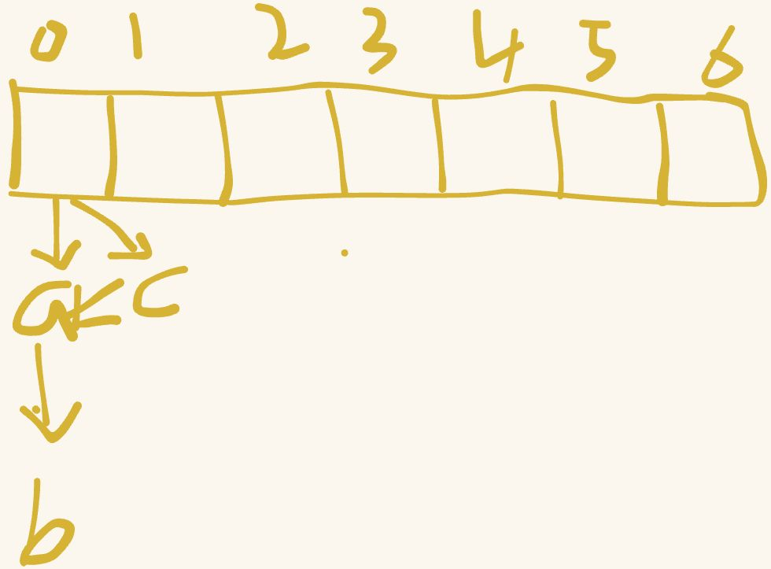

# HashMap

## 是什么
在Java8中，hashmap是一种key-value的集合，不保证key的顺序。

### 基本原理：
1. hash计算。默认初始容量为16，hash计算通过（初始容量-1)&key，直接就能获取hash值
2. 扩容。通过负载因子0.75，超过了进行扩容，扩容是2的倍数
3. 头插法。插入效率最高

### 数据结构
1.7及以前，数组+链表 

1.8以后，数组+链表+红黑树

### 关键参数
+ 初始容量：默认 16（必须是 2 的幂）
+ 负载因子：默认 0.75，用于权衡空间和时间效率（负载因子越小，哈希冲突概率越低，但空间利用率也越低）
+ 树化阈值：默认 8，链表转红黑树的临界长度
+ 反树化阈值：默认 6，红黑树退化为链表的临界长度

### 注意事项
并发成环问题

---

> 更新: 2023-05-02 07:12:04  
> 来源: 语雀导出
