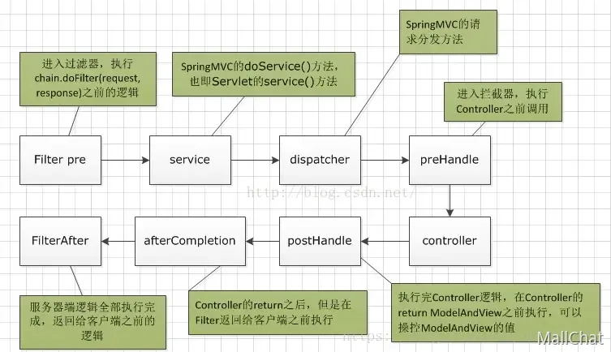

# Fileter和Inceptor

过滤器和拦截器都是Java Web开发中用于请求处理的组件，但本质与应用各有不同。

过滤器是Java Servlet规范定义的组件，不依赖Spring框架，作用于所有请求（包括静态资源），主要解决全局请求的统一处理问题，比如设置字符编码、过滤敏感词或实现跨域支持，使用时需实现Filter接口并通过web.xml或@WebFilter注解配置拦截路径；

而拦截器是Spring MVC框架的特有功能，依赖Spring容器，仅作用于DispatcherServlet分发的请求（即Controller方法），主要解决与业务逻辑结合的精细控制问题，比如权限校验、记录接口调用日志，使用时需实现HandlerInterceptor接口并在Spring配置类中通过WebMvcConfigurer注册，指定拦截规则。二者通过不同层面的拦截机制，共同提升了Web应用的可扩展性和安全性。

---

> 更新: 2023-07-06 19:52:04  
> 来源: 语雀导出
