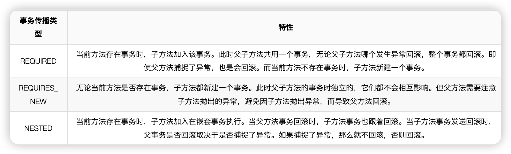
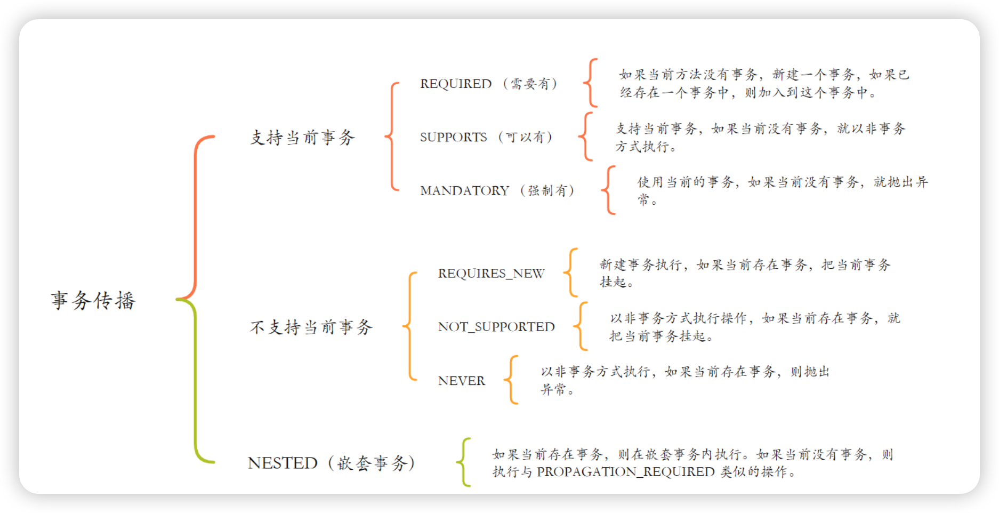

# spring事务

### 底层原理

Spring事务的底层原理通过<u>AOP</u>实现拦截，依托<u>事务管理器</u>操作底层资源，利用声明式配置解耦业务逻辑，并通过传播行为、隔离级别、回滚规则和线程绑定提供灵活性和隔离性。

`@Transactional` 默认只对 JDBC（MySQL 等）生效，不会影响到 Redis 操作。

事务应将数据操作都放在同一类下，最好不要太多的代码

事务方法放外层，不要调用

> 事务传播行为一般指2个以上的事务方法才有，一般是针对子事务来说的

### 失效场景

> 概况来讲，阻止spring获得代理对象的，或者就是数据库的问题的

#### 事务方法未被代理

```
- **原因**：Spring事务依赖AOP代理实现。如果事务方法在类内部直接调用（而非通过代理对象），事务将不会生效。  
- **示例**：在同一个类中，方法A（无事务）调用方法B（标注`@Transactional`），由于方法A未通过代理调用方法B，事务失效。  
- **解决方法**：将方法B抽取到另一个类中，或在方法A上也添加事务注解。
```

#### 异常被捕获且未抛出

```
- **原因**：Spring默认只对`RuntimeException`和`Error`回滚。如果方法中捕获了异常但未抛出，Spring无法感知异常，事务不会回滚。  
- **示例**：方法中try-catch块捕获`RuntimeException`并处理，未重新抛出。  
- **解决方法**：在catch块中重新抛出异常，或使用`@Transactional(rollbackFor = ...)`指定回滚异常。
```

#### 错误的传播行为

```
- **原因**：如果事务方法的传播行为设置为`NOT_SUPPORTED`或`NEVER`，方法将不参与事务。  
- **示例**：`@Transactional(propagation = Propagation.NOT_SUPPORTED)`会暂停当前事务，方法以非事务方式执行。  
- **解决方法**：根据业务需求选择合适的传播行为，如`REQUIRED`或`REQUIRES_NEW`。
```

#### 非public方法

```
- **原因**：Spring事务默认只对public方法生效。private或protected方法上的`@Transactional`可能无效。  
- **示例**：在private方法上添加`@Transactional`。  
- **解决方法**：将事务方法设为public，或使用AspectJ模式支持非public方法。
```

#### 数据库不支持事务

```
- **原因**：某些数据库引擎（如MySQL的MyISAM）不支持事务，使用时事务失效。  
- **示例**：在MyISAM表上执行事务操作。  
- **解决方法**：使用支持事务的引擎，如InnoDB。
```

#### 多数据源配置错误

```
- **原因**：在多数据源环境中，事务管理器未正确配置或与数据源不匹配，导致事务失效。  
- **示例**：使用错误的事务管理器或未指定。  
- **解决方法**：确保事务管理器与数据源正确关联。
```

#### 线程切换

```
- **原因**：Spring事务是线程本地的，切换线程后事务不会传递。  
- **示例**：在事务方法中启动新线程执行数据库操作，新线程操作无事务。  
- **解决方法**：避免在事务中切换线程，或在新线程中手动管理事务。
```

#### 手动提交或回滚

```
- **原因**：在事务方法中手动调用`Connection`的`commit()`或`rollback()`，干扰Spring事务管理。  
- **示例**：使用`DataSource.getConnection().commit()`。  
- **解决方法**：依赖Spring管理事务，避免手动干预。
```

#### 事务嵌套不当

```
- **原因**：不正确的事务嵌套可能导致失效，尤其是在`REQUIRES_NEW`或`NESTED`传播行为下。  
- **示例**：嵌套事务的回滚规则未正确配置。  
- **解决方法**：明确事务边界和回滚规则。
```

#### Spring Boot自动配置问题

```
- **原因**：未正确配置数据源或事务管理器。  
- **示例**：未引入`spring-boot-starter-jdbc`或`spring-boot-starter-data-jpa`。  
- **解决方法**：确保依赖和配置正确。
```

### 异步事务的处理

> * `@Async` 是通过 Spring 的异步代理（基于线程池）运行的，它会将方法提交到新线程执行。
> * `@Transactional` 是基于 AOP 实现的代理，需要当前线程内调用才能生效。
>
> 意思是，它们俩刚开始就是处于不同的线程了

1. 手动去管理
2. 使用`@Async注解 `+ `@Transactional ` ，使用spring注解bean的代理对象，去调用。但是不能写在一起，要是不同的两个类
3. 消息队列

### 事务方法相互调用

> 事务方法中可以 this 调用普通方法”（方法本来就在事务中）

1. 自己依赖注入
2. 利用Application获取代理对象，或者AopContext.currentProxy() 
3. 新创建一个事务类，spring依赖注入

### 事务传播行为

常见的事务传播类型





### 单事务VS多事务

| 场景 | 为什么要用多层事务？ | 如果只用大事务会怎样？ |
| :--- | :--- | :--- |
| **日志/审计记录** | 希望关键业务失败时依然能保留调用日志。   `logService.save()` 用 `REQUIRES_NEW`，总能写进库。 | 日志也跟着回滚，无法留痕。 |
| **异步补偿/料单生成** | 比如订单支付后，库存扣减失败，不想回滚支付动作。   可在扣减库存的方法上用 `REQUIRES_NEW`。 | 库存失败，整笔支付都会回滚。 |
| **长事务拆分** | 业务链路太长，拆分成几段短事务，避免锁持续太久影响并发。 | 单次事务太重，锁占用太久，数据库压力大。 |

* 整个业务是一致性原子操作：所有步骤都必须同时成功或同时失败。
* 业务量不大，锁的粒度和持有时间都能接受。
* 不需要在失败时保留任何子步骤的结果。

---

> 更新: 2023-07-24 18:53:13  
> 来源: 语雀导出
