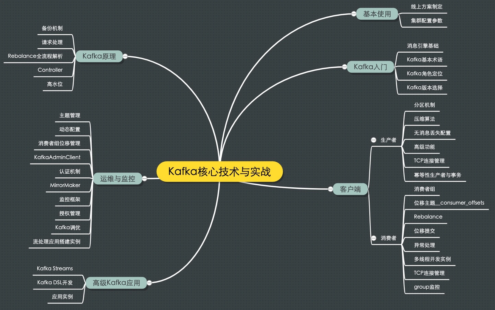
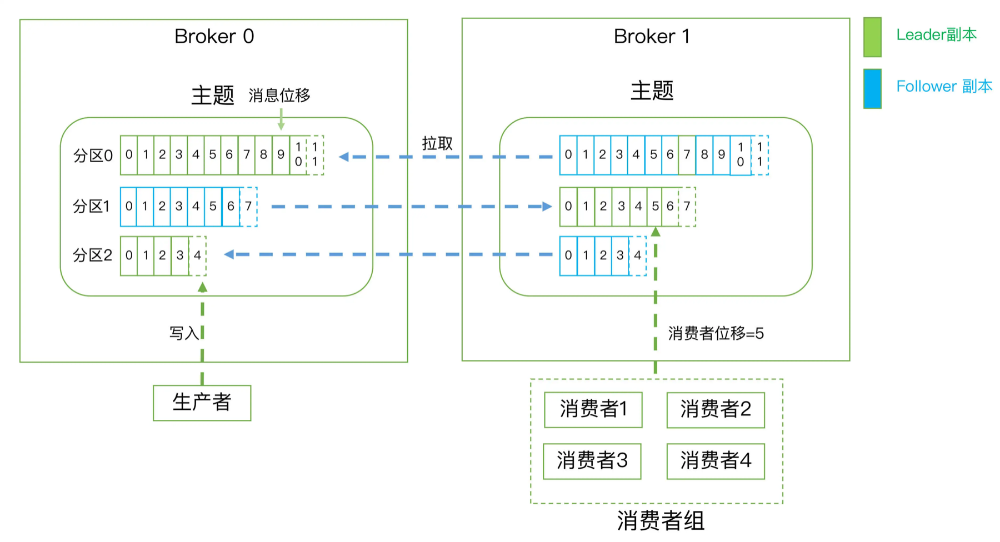

# 消息引擎系统ABC

## 思维导图

## 介绍
+ Apache Kafka是一款开源的消息引擎系统。根据维基百科的定义，消息引擎系统是一组规范。企业利用这组规范在不同系统之间传递语义准确的消息，实现松耦合的异步式数据传递。通俗来讲，就是系统A发送消息给消息引擎系统，系统B从消息引擎系统中读取A发送的消息。
+ 消息引擎系统要设定具体的传输协议，即我用什么方法把消息传输出去，常见的方法有2种：点对点模型；发布/订阅模型。Kafka同时支持这两种消息引擎模型。
+ 系统A不能直接发送消息给系统B，中间还要隔一个消息引擎呢，是为了“削峰填谷”。

## 常见概念
+ 消息：Record。Kafka是消息引擎嘛，这里的消息就是指Kafka处理的主要对象。
+ 主题：Topic。主题是承载消息的逻辑容器，在实际使用中多用来区分具体的业务。
+ 分区：Partition。一个有序不变的消息序列。每个主题下可以有多个分区。
+ 消息位移：Offset。表示分区中每条消息的位置信息，是一个单调递增且不变的值。
+ 副本：Replica。Kafka中同一条消息能够被拷贝到多个地方以提供数据冗余，这些地方就是所谓的副本。副本还分为领导者副本和追随者副本，各自有不同的角色划分。副本是在分区层级下的，即每个分区可配置多个副本实现高可用。
+ 生产者：Producer。向主题发布新消息的应用程序。
+ 消费者：Consumer。从主题订阅新消息的应用程序。
+ 消费者位移：Consumer Offset。表征消费者消费进度，每个消费者都有自己的消费者位移。
+ 消费者组：Consumer Group。多个消费者实例共同组成的一个组，同时消费多个分区以实现高吞吐。
+ 重平衡：Rebalance。消费者组内某个消费者实例挂掉后，其他消费者实例自动重新分配订阅主题分区的过程。Rebalance是Kafka消费者端实现高可用的重要手段。

## 特性
1. Kafka在设计之初就旨在提供三个方面的特性：提供一套API实现生产者和消费者；降低网络传输和磁盘存储开销；实现高伸缩性架构。
2. 作为流处理平台，Kafka与其他主流大数据流式计算框架相比，优势有两点：更容易实现端到端的正确性；它自己对于流式计算的定位。
3. Apache Kafka是消息引擎系统，也是一个分布式流处理平台。除此之外，Kafka还能够被用作分布式存储系统。不过我觉得你姑且了解下就好了，我从没有见过在实际生产环境中，有人把Kafka当作持久化存储来用。

---

> 更新: 2023-08-23 05:52:32  
> 来源: 语雀导出
