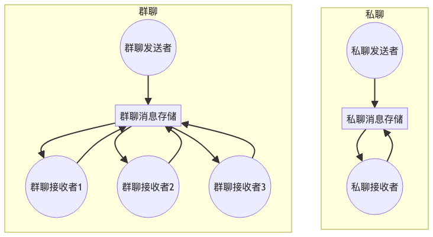
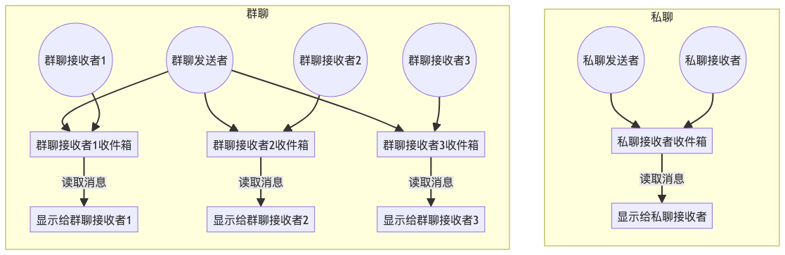
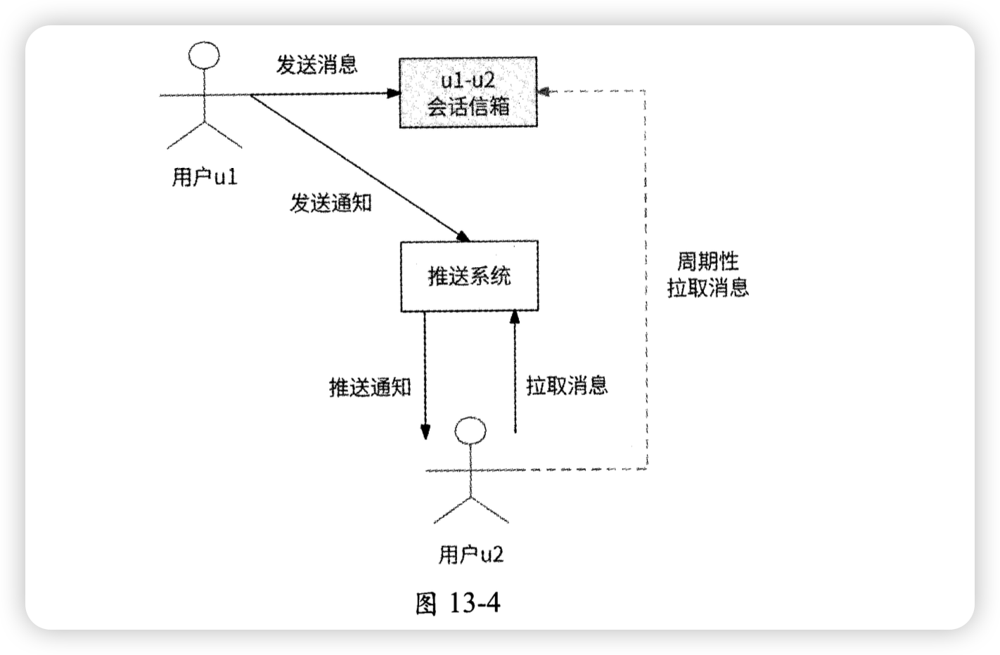
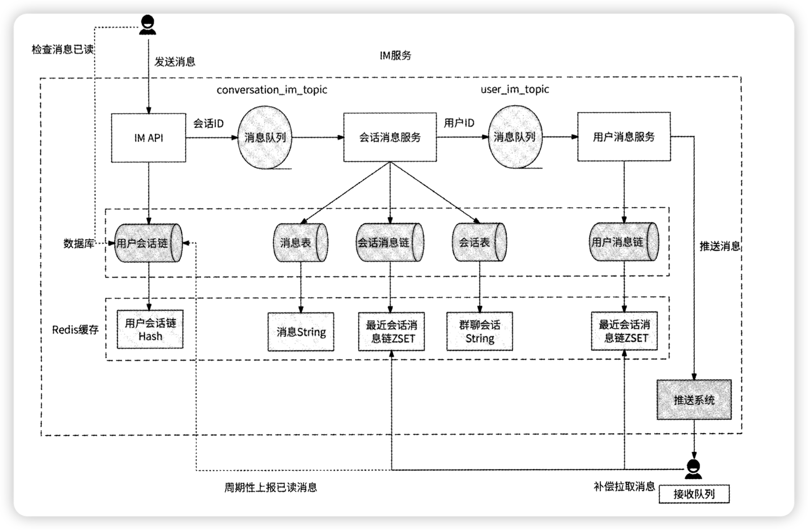

# IM服务

## 消息投递
会话：描述用户通过聊天建立的关联关系。通俗地说，微信中的每个聊天框都是一个会话，比如你和一个好友聊天，你们就建立了会话；你被拉到某个群里聊天，你就和这个群建立了会话。会话是IM服务的核心概念，它真正指明了消息应该被发送给哪些用户。

信箱：对于用户来说，每个会话都有一个抽象的信箱，作为会话中每条消息按照时间顺序由远及近排列的存储容器。

会话消息链：服务于读扩散模式，存储会话中的消息ID列表。

用户消息链：服务于写扩散模式，存储每个用户的消息ID列表。

### 读写扩散
一般有两种模式，分为读扩散和写扩散。读扩散是每个用户针对聊天一个中央消息存储，不管有多少个用户，所以导致读取的时候，每个用户都得从这获取，造成读扩散。写扩散则是用户针对聊天的对象，都会有之对应的信箱，造成写扩散，自然读取就方便了，但是对于群聊来说，群聊有N个用户，就得有N个信箱。

### 推拉模式
拉模式则是客户端主动拉取所有会话中未读的信息，推模式是服务端通过长连接向客户端推送。推模式因为需要长连接，所以只能在接收方在线的时候进行推送，因此仅靠推模式是实现不了的。目前都是推拉结合，推保证用户实时性，拉用作兜底

## 消息的有序性
可通过统一消息发送入口，内部借助 MQ 处理流量来保证。也可通过在会话消息链表和用户消息链中设置 “seq” 字段作为消息序列号，以此确保消息顺序。

## 会话管理

## 消息回执
1. 上报已读消息

## 高并发架构
1. 消息队列分区
2. Redis缓存
3. 消息优先级

---

> 更新: 2023-09-11 21:02:24  
> 来源: 语雀导出
