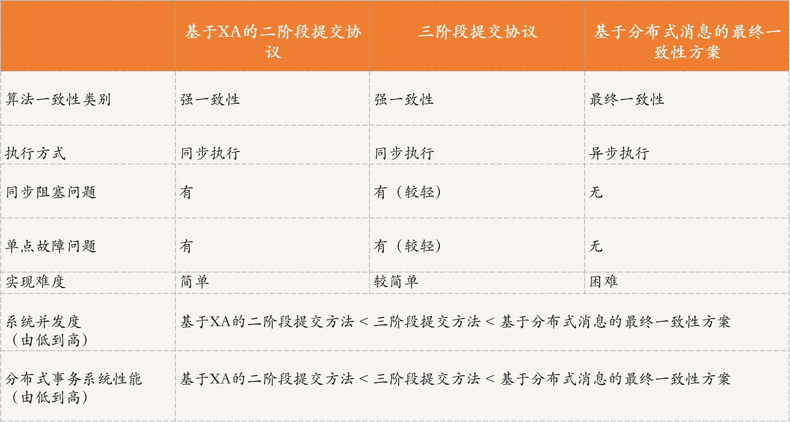
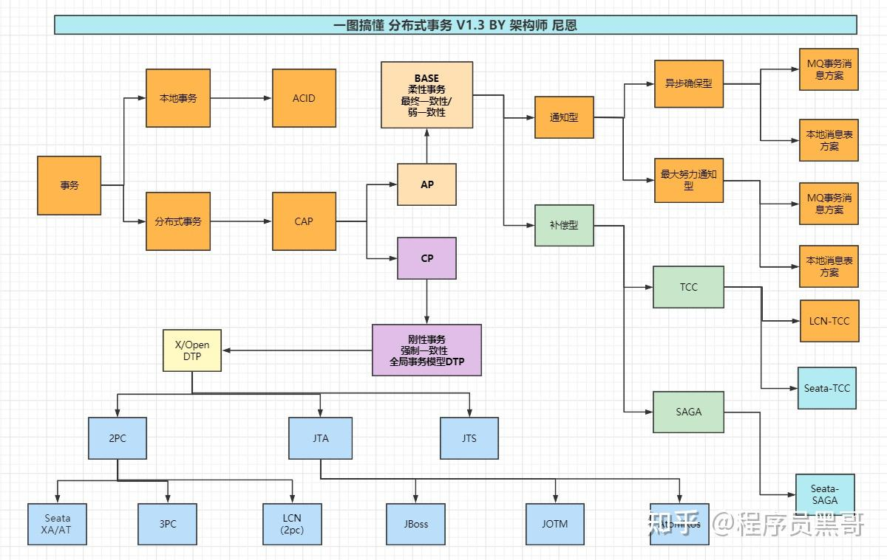

# 分布式事务

### 分案实现

### 2pc和3pc的区别
1. 与 2PC 只是在协调者引入**超时机制**不同，3PC 同时在协调者和参与者中引入了超时机制。如果协调者或参与者在规定的时间内没有接收到来自其他节点的响应，就会根据当前的状态选择提交或者终止整个事务，从而减少了整个集群的阻塞时间，在一定程度上减少或减弱了 2PC 中出现的同步阻塞问题。
2. 在第一阶段和第二阶段中间引入了一个**准备阶段**，或者说把 2PC 的投票阶段一分为二，也就是在提交阶段之前，加入了一个预提交阶段。在预提交阶段尽可能排除一些不一致的情况，保证在最后提交之前各参与节点的状态是一致的。

---

> 更新: 2023-10-05 20:03:21  
> 来源: 语雀导出
