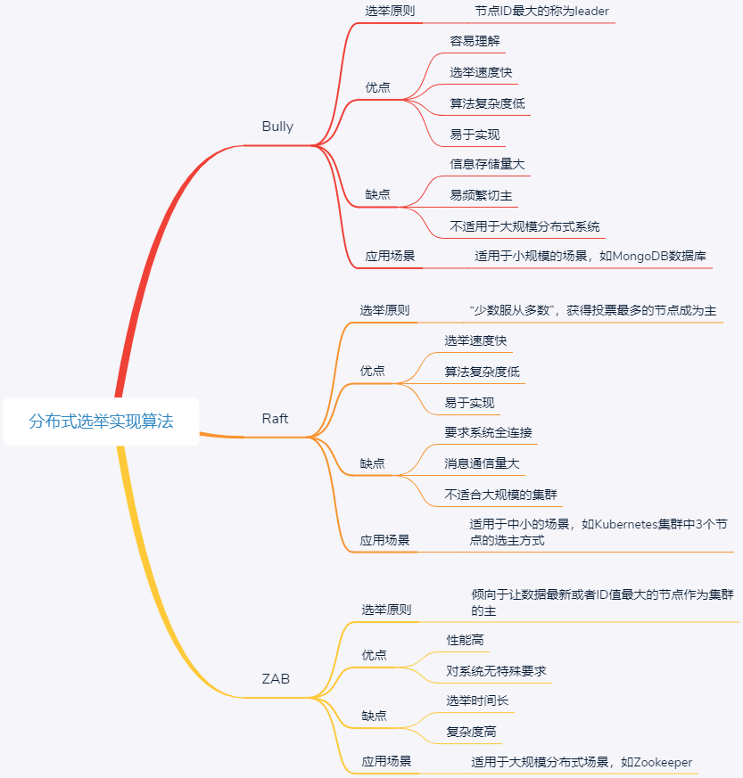

# 分布式选举

主要是处理一致性问题，主节点修改，应该需要同步从节点

1：分布式选主算法，为选主而生，那为啥非要有一个主哪？人人平等不好嘛？分布式系统和人类社会非常的像，如果没有主，有些事情特别是有冲突的需要协作完成的，有谁来负责呢？针对数据库，好多机器都存数据，为了提高性能和可用性，如果都能接受写请求，各个库中的数据不一致了，又该怎么办呢？这就是要有主的原因了！ 

2：选主的算法，老师介绍了三种经典的，已经总结的很好了，我就不总结啦！我来个比喻，方便记忆。 

bully算法——类似选武林盟主，谁武功最高，

谁来当 raft算法——类似选总统，谁票数最高，

谁来当 zab算法——类似选优秀班干部，是班干部且票多才行

---

> 更新: 2023-11-01 05:29:18  
> 来源: 语雀导出
