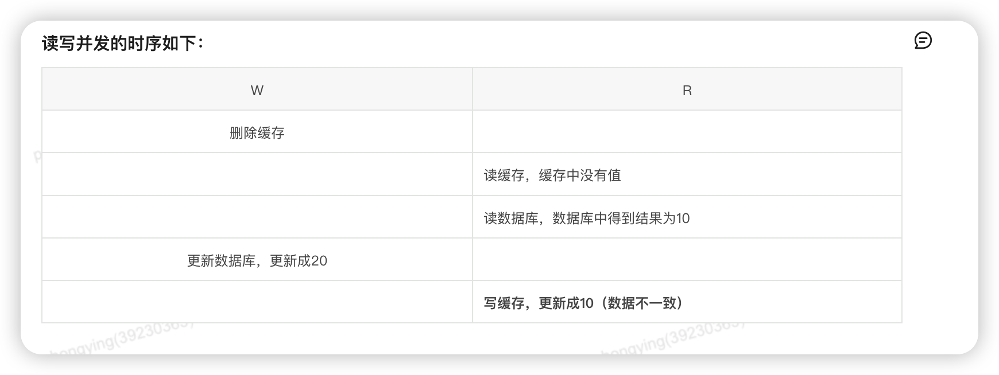

# 缓存和数据库一致性

首先，Redis和MySQL是不同的服务，是分布式的，所以不能保证百分百的一致，但是我们可以通过一些手段来实现一致。

**是删缓存还是更新缓存**

删缓存。原有有，更新缓存更浪费时间，因为可能会修改很多的内容，导致耗时很长，数据库和缓存不一致的时间增加；更新缓存

**是先更新数据库，还是先删缓存**

**只需要关心第二步操作是否成功，第一个失败，第二步就不用看了，主要是第二步导致数据不一致。**

其实这两个都可以，看具体的业务情况，并发程度不高的话，可以先更新数据库，后删缓存。好处是读写并发的情况，处理比较好，坏处的话就是缓存删除失败的话，导致数据不一致。

另外一种，就是先删缓存，后更新数据库。这种的话就不怕数据库更新失败，数据库失败了，就相当于把缓存删了而已，问题的话，就会导致读写并发问题，导致更新后的数据被覆盖掉了

**延迟双删**

我理解的，就是针对“先删缓存，后更新数据”进行了优化，对最后可能产生覆盖的缓存删掉，一般设置1-2s即可

---

> 更新: 2024-07-14 03:57:45  
> 来源: 语雀导出
