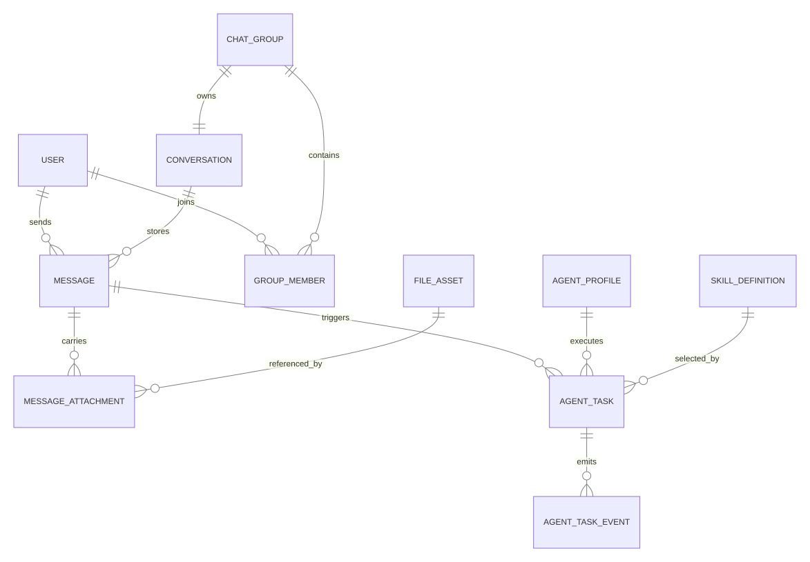
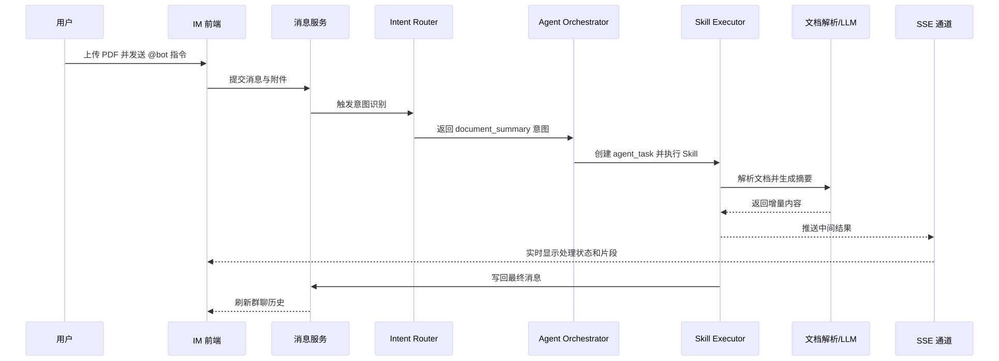

# 无标题文档

# 融合多 AI Agent 的协作式 IM 系统研究与实现

## 摘要

随着团队协作场景的在线化、实时化与资料密集化发展，即时通讯系统已由单纯的信息传递工具逐步演化为组织协同的重要基础设施。然而，传统 IM 系统主要面向消息收发与会话管理设计，对于群聊场景中频繁出现的文档摘要、关键信息提取、待办整理与协同决策支持等需求缺乏内生支撑能力。与此同时，现有 AI 工具虽然在文本理解与生成方面表现出较强能力，但大多以独立应用或外挂插件形式存在，用户在实际协作过程中仍需频繁切换系统，容易造成流程割裂、上下文丢失与响应滞后。如何在不破坏即时通讯主流程稳定性的前提下，将多 AI Agent 能力以低耦合、可扩展、可编排的方式嵌入群聊协作场景，已成为智能协作平台设计中的关键问题。

围绕上述问题，本文面向浏览器端群聊协作场景，提出一种融合多 AI Agent 的协作式 IM 系统设计方案。该方案以消息为中心的数据模型为基础，将用户消息、附件消息、Agent 任务、事件流与结果消息统一纳入会话语境，构建了由 Intent Router、Agent Orchestrator、Skill Registry、Skill Executor 与 Message Writer 组成的协作框架，并采用 Server-Sent Events 实现 Agent 执行过程的流式可视化反馈。本文在系统设计过程中采用文献研究法、场景分析法与原型设计法，结合即时通讯系统、文档理解技术与 Agent 编排机制的相关研究，提出适用于首版落地的技术选型、上下文持久化策略与 MVP 完成标准。

本文主要完成了以下工作：第一，分析传统 IM 工具与独立 AI 工具在协作链路中的结构性脱节，提炼出协作式 IM 系统在消息统一建模、任务可追溯、流式可见性与能力扩展性方面的核心需求；第二，提出以消息为中心的多 Agent 协作架构，完成系统总体架构、核心实体关系、运行时流程、会话级持久化边界以及演进路径设计；第三，围绕“群聊上传 PDF 并触发 Agent 分析”的典型场景，给出原型实现方案、关键模块职责划分与系统验证设计。研究表明，以消息为中心的统一建模方式能够在保持 IM 主链路稳定的同时，为 AI 能力嵌入提供清晰的系统边界；基于“Bot 负责调度、Agent 负责执行、Skill 负责最小能力单元”的分层协作机制，能够有效提升系统的可扩展性、可维护性与协作表达能力。本文的研究可为多 Agent 技术在即时通讯场景中的工程化应用提供参考，并为后续智能协作平台的持续演进奠定基础。

**关键词：** 即时通讯；多 AI Agent；协作系统；文档理解；Skill 编排；流式交互

## Abstract

With the growth of online, real-time, and document-intensive collaboration, instant messaging systems have evolved from simple communication tools into core infrastructures for organizational coordination. However, conventional IM systems are primarily designed for message delivery and conversation management, and lack built-in support for high-frequency collaborative tasks such as document summarization, key fact extraction, to-do generation, and decision support. Meanwhile, although recent AI tools have achieved strong performance in language understanding and generation, they are usually deployed as standalone applications or external plugins, forcing users to switch contexts repeatedly and causing workflow fragmentation, context loss, and delayed response. Therefore, a key research problem is how to integrate multiple AI agents into IM workflows in a low-coupling, extensible, and orchestratable manner without disrupting the stability of the communication system itself.

To address this problem, this paper proposes a collaborative IM system integrated with multiple AI agents for browser-based group conversations. The proposed system is built upon a message-centered data model, where user messages, attachments, agent tasks, event streams, and result messages are all organized within a unified conversational context. A layered collaboration framework is designed, including an Intent Router, Agent Orchestrator, Skill Registry, Skill Executor, and Message Writer, while Server-Sent Events are adopted to provide streamed and visible feedback during agent execution. The research combines literature review, scenario analysis, and prototype-oriented design to derive an implementation path, technology selection, session-level persistence strategy, and MVP definition suitable for the first-stage system.

The main contributions of this work are as follows. First, it identifies the structural gap between traditional IM workflows and standalone AI tools, and extracts the core requirements of a collaborative IM system in terms of message unification, task traceability, streaming visibility, and extensibility. Second, it proposes a message-centered multi-agent collaboration architecture, including overall architecture design, core entity relationships, runtime workflow, persistence boundary, and evolution path. Third, based on a representative scenario in which a PDF document is uploaded and analyzed in a group conversation, it presents a prototype implementation scheme, responsibility decomposition of key modules, and a validation plan. The analysis indicates that message-centered modeling can preserve the stability of the IM main workflow while providing clear integration boundaries for AI capabilities. In addition, the layered collaboration paradigm, where the bot handles routing, agents handle execution, and skills act as minimal capability units, can effectively improve system extensibility, maintainability, and collaboration expressiveness. This work provides a practical reference for applying multi-agent technologies to instant messaging systems and lays a foundation for the further evolution of intelligent collaboration platforms.

**Keywords:** instant messaging; multi-agent system; collaborative system; document understanding; skill orchestration; streaming interaction

## 第 1 章 绪论

### 1.1 研究背景

在数字化办公与在线协同持续深化的背景下，即时通讯系统已经成为组织内部沟通、任务协调、资料共享与知识沉淀的关键入口。与电子邮件、项目管理系统或知识库相比，IM 系统具备实时性强、交互成本低、群体参与度高等特点，因此在实际工作中承担了大量跨角色、跨环节的信息交互任务。尤其在项目推进、方案讨论、周报同步和问题排查等场景中，群聊常常同时承载“沟通渠道”和“协作现场”两种角色。

然而，随着协作内容愈发复杂，传统 IM 系统的能力边界逐渐显现。一方面，群聊中的有效信息越来越多地以 PDF 报告、在线文档、网页链接、表格截屏等形式存在，而非仅以短文本出现；另一方面，用户在会话过程中经常需要完成摘要、提炼、归类、问答、待办整理等高认知负荷工作。如果仍依赖人工阅读、人工总结或切换至外部 AI 工具处理，不仅会增加操作成本，也会导致上下文断裂，进而降低协作效率与结论一致性。

与此同时，大型语言模型和 AI Agent 技术的快速发展为解决上述问题提供了新的可能。与传统规则式机器人相比，AI Agent 具备更强的上下文理解、任务分解、工具调用与结果整合能力，使其能够从“被动回答者”转向“协作参与者”。在群聊场景中，如果 Agent 能够直接理解当前会话上下文、识别用户意图、调用适当能力，并将执行过程与结果自然写回消息流中，则 IM 系统有望从“通信工具”进一步演进为“智能协作平台”。

基于这一认识，本文将研究重点聚焦于“融合多 AI Agent 的协作式 IM 系统”。本文并非简单讨论如何在聊天窗口中接入大模型，而是关注在浏览器端协作环境下，如何建立一种既能保持消息系统稳定性，又能支持多 Agent 能力接入、调度、执行、回写与扩展的系统化方案。

### 1.2 研究目的与意义

本文的研究目的在于设计一套面向浏览器端群聊场景的协作式 IM 系统方案，使用户能够在原有沟通场景中，通过自然语言直接触发多种 AI 能力，完成文档摘要、关键信息提取、待办生成和对话总结等任务，从而实现“对话即服务”的智能协作体验。

从理论层面看，本文试图回答多 Agent 技术如何与即时通讯系统共同构成统一协作底座的问题。该问题不仅涉及消息模型、上下文建模与任务生命周期管理，还涉及意图识别、能力注册、执行编排与结果消息化回写等多方面设计。围绕上述问题展开系统性分析，有助于丰富智能协作系统与对话式人机协同在工程实现方面的研究内容。

从实践层面看，协作式 IM 系统能够将 AI 能力前置到组织最常用的沟通入口，使文档理解、信息提炼与协作支持在原位完成，减少用户在多系统之间切换的时间与认知损耗。同时，Agent 处理结果以消息形式沉淀在会话历史中，有利于后续复盘、追问、共享与知识延展。因此，该研究在企业协同办公、项目型团队管理和知识工作支持等场景中具有较高的应用价值。

### 1.3 研究内容与研究方法

围绕研究目标，本文主要开展以下几个方面的工作：

1. 结合即时通讯和智能协作场景，分析传统 IM 系统与独立 AI 工具在协作链路中的问题与不足。
2. 提炼协作式 IM 系统在功能、实时性、可追溯性、可扩展性等方面的核心需求。
3. 设计以消息为中心的数据模型，统一管理会话、消息、附件、Agent 任务与事件流。
4. 设计多 Agent 协作框架，重点研究意图识别、能力注册、任务编排、流式输出与结果回写机制。
5. 基于典型协作场景，提出首版原型的技术选型、上下文持久化策略、MVP 完成标准与验证方案。

在研究方法上，本文综合采用以下方法：

1. **文献研究法。** 通过梳理即时通讯系统、WebSocket 实时通信、Agent 架构、文档理解与检索增强生成等相关研究，为系统设计提供理论依据。
2. **场景分析法。** 围绕浏览器端群聊协作流程，识别用户在真实协作中的关键任务、信息载体与交互痛点。
3. **原型设计法。** 以可落地的原型系统为导向，对核心模块、数据模型、系统边界与演进路径进行设计，强调论文表达与工程实现的一致性。

### 1.4 本文的主要创新点

结合现有相关研究与本文设计方案，本文的主要创新点可概括为以下三个方面：

1. **提出面向群聊协作场景的消息中心建模方式。** 本文将用户消息、附件消息、Agent 任务、执行事件与结果消息统一纳入同一会话语境，避免 IM 与 AI 子系统分别维护独立事实源，从而为系统扩展和上下文追溯提供了更清晰的边界。
2. **提出基于 Skill 的多 Agent 分层协作框架。** 相较于将所有能力封装到单一大型 Agent 中，本文将协作链路拆解为 Intent Router、Agent Orchestrator、Skill Registry、Skill Executor 和 Message Writer 等明确层次，有利于降低系统耦合度并增强能力编排的可维护性。
3. **形成面向首版落地的边界控制策略。** 本文没有将复杂多 Agent 自治、分布式拆分和长期知识记忆作为首版刚性目标，而是提出“模块化单体 + 会话级持久化 + 少而精的 Skill 集”的原型实现路径，在保证论文可信度的同时兼顾工程可行性。

### 1.5 论文结构安排

全文共分为六章。第一章介绍研究背景、研究目的、研究内容、研究方法与主要创新点。第二章分析相关研究现状与技术基础。第三章从业务场景出发进行需求分析，并明确技术选型与首版边界。第四章重点阐述系统总体架构、消息中心模型、多 Agent 协作机制及演进路径。第五章围绕原型实现方案、关键业务流程、Skill 设计、持久化策略与验证方案展开说明。第六章对全文进行总结，并讨论后续研究方向。

## 第 2 章 相关研究与技术基础

### 2.1 即时通讯系统研究现状

即时通讯系统的研究长期围绕通信协议、在线状态管理、消息可靠投递、会话同步、群聊扩展性与高并发支撑等问题展开。随着 B/S 架构和多端协同需求的增长，WebSocket、长连接管理、消息缓存、会话持久化、多终端同步等技术逐渐成为现代 IM 系统的核心组成部分。已有研究在企业内部 IM、平台型 IM 和高并发群聊系统方面形成了较为完整的工程经验。

从当前收集到的参考文献线索看，已有工作主要集中于三类：一是面向 Java 或 Web 技术栈的即时通讯系统设计与实现研究；二是面向企业内部使用场景的 IM 架构设计研究；三是围绕微服务、高并发与海量在线用户场景展开的关键技术研究。这些研究为本文开展协作式 IM 系统设计提供了消息通信层面的技术基础，但大多仍将 IM 系统视为“信息传递通道”，较少从“智能协作底座”的角度进行系统设计。

### 2.2 AI Agent 与文档理解研究现状

近年来，大语言模型推动了文本生成、文本理解、问答推理与信息提取等能力的快速提升。基于大语言模型构建的 AI Agent 系统进一步强化了任务规划、工具调用、上下文管理和结果整合等能力，使机器在复杂任务中的参与方式由“单轮回答”转向“过程协作”。在垂直场景中，Agent 常与知识检索、外部工具、业务规则和工作流引擎结合，以提升问题处理效率与场景适配能力。

与此同时，文档理解相关技术不断成熟。围绕 PDF、Markdown、网页与结构化文本的处理，研究者通常结合文档解析、文本切分、检索增强、向量召回、重排序和结构化抽取等方法，提高长文本场景下的信息利用效率。这些成果为群聊场景中的文档摘要、关键信息提取与问答能力提供了方法基础。

但从协作角度看，当前大多数 AI Agent 应用仍以独立对话界面、业务外挂工具或办公插件形式存在，尚未与高频沟通场景建立稳定、统一、可追溯的上下文关系。尤其在多人参与的群聊环境中，如何将 Agent 的执行状态、输入上下文与输出结果统一沉淀到消息历史中，仍是一个值得深入研究的问题。

### 2.3 相关技术基础

为支撑协作式 IM 系统的设计与实现，本文重点涉及以下几类技术。

#### 2.3.1 WebSocket 与长连接通信

WebSocket 协议支持浏览器与服务端之间建立双向、持续的通信通道，适合用于即时通讯场景下的在线状态同步、消息推送与交互事件传递。与传统短连接或轮询方式相比，WebSocket 能够显著降低通信延迟和重复开销，因此是 IM 系统构建实时消息通道的重要基础。

#### 2.3.2 Server-Sent Events 流式推送

在 Agent 任务执行过程中，系统不仅需要返回最终结果，还需要向用户持续展示处理中间状态与增量内容。SSE 采用服务端向客户端单向推送的方式，具有实现简单、浏览器支持良好、适合流式文本输出等特点，因此适合作为 Agent 结果逐步回传的实现方式。与 WebSocket 相比，SSE 在单向文本流场景下具有更低的实现复杂度。

#### 2.3.3 文档解析与检索增强思路

针对 PDF、Markdown 与网页内容等异构文本载体，系统需要先完成文档解析、文本清洗与必要的结构化处理，再根据业务需要进行摘要、问答或信息抽取。在这一过程中，检索增强生成等思路可用于提高长文档处理效果，为 Agent 提供更高质量的上下文支持。

#### 2.3.4 Agent 编排与能力注册机制

多 Agent 系统的核心并不只在于引入多个模型实例，而在于如何定义能力边界、约束输入输出、维护执行状态并组织多能力协作。能力注册机制有助于将不同 Agent 或 Skill 的职责显式化；任务编排机制则负责在运行时根据用户意图选择能力、分发任务并汇总结果，从而保证系统行为具有可解释性与可维护性。

### 2.4 现有研究存在的问题

综合以上分析，现有研究在协作式 IM 与多 Agent 融合方面仍存在以下不足：

1. **通信系统与智能能力之间缺少统一建模。** 传统 IM 系统通常将消息与会话视为核心，而将 AI 能力视为外部扩展，导致上下文、执行状态与结果沉淀缺少统一语义。
2. **单一大模型式接入难以满足异构协作需求。** 文档摘要、事实抽取、待办生成和问答支持在目标、输入与输出形式上存在显著差异，若全部由单一 Agent 承担，会导致系统边界模糊、质量控制困难。
3. **多人协作场景中的过程可见性不足。** 很多 AI 工具仅返回最终结论，缺少对中间执行过程和任务状态的展示，难以满足群聊环境下对透明性与可追溯性的要求。
4. **工程落地与论文叙事之间常存在脱节。** 有些方案过于强调分布式架构和复杂工作流，虽然技术上完整，但在实际原型构建与本科论文周期中难以实现高质量闭环。

### 2.5 本章小结

本章从即时通讯系统、AI Agent 与文档理解技术三个方面分析了相关研究现状，并指出当前研究在统一建模、能力协作、过程可见性与工程落地方面仍存在不足。以上分析表明，构建一个面向群聊场景、以消息为中心、支持多 Agent 协作的 IM 系统具有明确的研究价值和现实意义，也为后续需求分析与系统设计提供了理论基础。

## 第 3 章 系统需求分析

### 3.1 目标场景分析

本文面向的核心场景是浏览器端的团队群聊协作。用户在一个统一的 IM 界面中进行沟通、共享资料和协同处理信息。当群成员上传 PDF 报告、方案文档或网页资料后，其他成员往往希望立即获得结构化摘要、关键数据、任务清单或针对文档内容的问答支持。在传统流程中，这些工作通常依赖人工阅读或切换到外部 AI 工具完成，难以与会话上下文保持一致。

因此，本文设定的目标场景具有以下特征：第一，用户交互主要围绕群聊消息展开，消息与附件是最主要的信息载体；第二，AI 能力应在会话现场被直接触发，而不是在外部系统中单独执行；第三，任务执行过程应具备可见性，避免长时间黑盒运行；第四，所有处理结果都应沉淀在群聊历史中，便于多成员共享、追问与复盘。

### 3.2 功能需求分析

结合场景特点，本文将系统功能需求概括为以下几个方面：

1. **基础通信能力。** 系统应支持用户登录、群组管理、会话管理、消息收发与附件上传等 IM 基础功能。
2. **Agent 触发能力。** 系统应支持用户通过 `@bot` 或 `@agent` 等方式直接发起智能任务，并基于当前消息、历史上下文与附件信息完成意图识别。
3. **多 Skill 协作能力。** 系统应至少支持文档摘要、关键信息提取、待办生成、对话总结与文档问答等高频 Skill。
4. **流式反馈能力。** 系统应能够在 Agent 执行过程中持续返回状态提示和增量输出，降低用户等待焦虑。
5. **任务沉淀与追溯能力。** 系统应能够记录任务来源、执行状态、事件流和最终结果，以支撑会话恢复、过程回溯与后续分析。

### 3.3 非功能需求分析

除功能需求外，系统还需满足以下非功能目标：

1. **低耦合。** IM 模块与 Agent 模块应通过清晰接口协作，避免因能力扩展导致系统结构失控。
2. **可扩展。** 系统应允许在不大幅修改主链路的前提下新增 Skill 或调整 Agent 路由策略。
3. **可维护。** 各层职责需要明确，保证系统具有较强的模块可替换性与调试友好性。
4. **实时性。** 消息交互与 Agent 响应应具备较低时延，尤其在流式反馈场景中应保证用户感知的连续性。
5. **可演进性。** 首版实现应以可演示闭环为目标，同时为后续服务拆分、长期记忆与复杂工作流扩展保留空间。

### 3.4 技术可行性分析

从前端实现角度看，React 或 Vue 等现代 Web 框架能够较好支撑会话列表、群聊窗口、附件上传与流式结果渲染等交互需求。结合 WebSocket 与 SSE，可分别实现消息实时收发与 Agent 增量输出展示。

从后端实现角度看，Spring Boot 可用于构建用户、会话、消息、文件和 Agent 编排等核心模块，Netty 或嵌入式 WebSocket 网关可支撑实时通信需求，MySQL 与 Redis 则可分别承担持久化存储和高频状态缓存任务。文档解析可依赖 PDFBox、Tika 等成熟方案，大模型调用可通过兼容 OpenAI 的适配层完成。

从工程组织角度看，采用模块化单体作为首版落地形态，能够在有限周期内优先完成关键链路闭环，并降低服务拆分、异步任务、长期记忆等复杂基础设施带来的联调压力，因此具备较高可行性。

### 3.5 技术选型与首版边界

结合研究目标与原型构建需求，本文将首版原型的技术栈控制在“结构清晰、可落地、易演示”的范围内。推荐技术方案为：前端采用 React + Vite + TypeScript，后端采用 Spring Boot 3 + Java 21，实时通信采用 Netty 模块或嵌入式 WebSocket 网关，流式输出采用 SSE，数据存储采用 MySQL 8 与 Redis，文档解析采用 PDFBox 或 Tika，大模型调用采用兼容 OpenAI 风格的接口适配方式。

在部署形态上，首版系统采用“一个前端应用 + 一个后端应用 + 一个 MySQL + 一个 Redis + 本地文件目录”的结构。该阶段不拆分微服务、不引入消息队列、不接入向量数据库，也不构建跨会话长期知识记忆。这一边界控制策略的核心目的在于将资源集中于“上传文档 - 触发 Agent - 流式反馈 - 结果沉淀”的主链路验证，而非过早进入高复杂度基础设施建设。

### 3.6 MVP 完成标准

为保证首版原型具有明确目标，本文将其完成标准界定为以下内容：

1. 支持测试账号登录与基础用户体系。
2. 支持联系人、群组与群聊消息的实时收发。
3. 支持 PDF 上传并将文件绑定到群消息。
4. 支持 `@bot` 或 `@doc-agent` 触发意图识别与 Skill 路由。
5. 支持 SSE 流式回复。
6. 至少实现文档摘要、关键数据提取与待办提取 3 个核心 Skill。
7. 支持会话级持久化，使用户在刷新页面或重新登录后能够恢复上下文。
8. 形成完整论文演示闭环，即上传文档后能够返回摘要、关键点与待办结果。

### 3.7 本章小结

本章围绕浏览器端群聊协作场景完成了系统需求分析，明确了协作式 IM 系统的功能需求、非功能需求、技术可行性与首版边界控制策略，并给出了可操作的 MVP 完成标准。以上内容为后续系统架构设计和原型实现方案提供了直接依据。

## 第 4 章 系统总体设计

### 4.1 设计原则

为保证系统设计既满足协作需求，又具备工程可行性，本文在总体设计中遵循以下原则：

1. **消息中心原则。** 所有协作行为均应围绕会话与消息展开，避免消息系统与 Agent 系统并行演化。
2. **职责分层原则。** 将意图识别、任务编排、能力注册、能力执行与结果回写拆解为独立层次，减少耦合。
3. **会话内闭环原则.** 首版系统重点保证单次会话内的智能协作闭环，而非追求全局长期记忆。
4. **渐进演进原则。** 首版先采用模块化单体实现，后续再根据需求演进到服务边界清晰化与分布式扩展。

### 4.2 系统总体架构设计

系统总体架构由前端交互层、IM 核心服务层、Agent 协作层、状态持久化层与外部能力层构成。前端交互层负责会话展示、附件上传、Agent 状态显示与流式输出渲染；IM 核心服务层负责用户、群组、会话、消息与附件等基础业务；Agent 协作层负责意图识别、任务编排、Skill 路由与结果回写；状态持久化层负责会话、消息、任务状态与流式快照保存；外部能力层则负责文档解析、大模型调用和必要的工具集成。

该架构的关键不在于“引入一个大模型接口”，而在于围绕消息主链路设计一套可调度、可追踪、可扩展的协作机制。系统在运行时由消息触发 Agent 流程，由事件流承载中间状态，由消息回写完成结果沉淀。

如图 4-1 所示，系统总体架构强调在 IM 主链路稳定运行的前提下按需接入 AI 能力，从而避免将聊天系统改造为完全依赖大模型的黑盒系统。

图 4-1 系统总体架构图

### 4.3 消息中心数据模型设计

消息中心模型是本文系统设计的基础。传统做法通常将 AI 输出视为会话外部结果，从而造成消息历史、任务状态和结果记录分离。为此，本文将消息定义为协作系统中的统一事实源，并形成以下约束：

1. 普通用户消息、附件消息与 Agent 输出消息均属于统一消息体系。
2. 文件不脱离消息存在，而是通过消息附件与具体会话绑定。
3. Agent 任务必须记录其触发来源消息。
4. Agent 任务的中间事件与最终结果均需回写到统一消息或任务事件记录中。
5. 会话恢复以“消息历史 + 任务状态”为基本依据，而非额外维护不透明的上下文缓存。

这一设计使系统能够在不破坏 IM 基础语义的前提下，将 AI 能力自然嵌入消息流。消息不仅是信息传递载体，也是任务触发入口、状态跟踪媒介和结果沉淀容器。

图 4-2 展示了系统核心实体之间的关系。

图 4-2 消息中心数据模型图

### 4.4 核心实体与模块职责设计

从领域划分上看，系统实体可以归为 IM 域与 File & Agent 域两类。IM 域主要包含 `user`、`contact_relation`、`chat_group`、`group_member`、`conversation` 与 `message` 等实体，用于支撑基础通信逻辑；File & Agent 域主要包含 `file_asset`、`message_attachment`、`agent_profile`、`agent_task`、`agent_task_event` 与 `skill_definition` 等实体，用于描述附件、能力定义、任务状态与执行过程。

其中，`agent_task` 是系统中连接消息与 AI 执行链路的关键对象。它既记录任务来源消息、所选 Skill 与执行者身份，也记录任务当前状态、执行结果摘要与事件流索引。`agent_task_event` 则用于保存流式片段、阶段状态和关键执行节点，为前端展示、故障分析与流程追溯提供支撑。

### 4.5 多 Agent 协作机制设计

为避免系统退化为“单一大型 Agent 处理所有任务”的黑盒模式，本文将协作链路拆解为以下几个层次：

1. **Intent Router。** 负责识别消息是否触发智能协作，并判断任务意图。
2. **Agent Orchestrator。** 负责创建任务、组织执行链路并协调不同 Skill。
3. **Skill Registry。** 维护能力定义、输入约束、调用方式与路由规则。
4. **Skill Executor。** 负责具体能力执行，如文档摘要、事实提取和待办生成。
5. **Message Writer。** 负责将中间事件与最终结果转换为消息或任务记录。

这一机制的核心思想是“Bot 负责调度，Agent 负责执行，Skill 负责最小能力单元”。这一分层方式具有三个优势：第一，能力边界清晰，有利于质量控制；第二，Skill 颗粒度更小，便于扩展与测试；第三，系统更容易形成可解释的执行链路。

图 4-3 展示了消息触发到结果回写的运行时协作过程。

图 4-3 多 Agent 协作机制图

### 4.6 持久化边界与系统演进路径

首版系统在持久化策略上采取“会话级必要持久化”的原则。系统持久化聊天消息历史、群组与成员关系、上传文件元数据、`agent_task` 状态与结果，以及最近一次流式输出快照，以保证用户在刷新页面或重新登录后能够恢复当前会话与任务状态。

与之对应，系统在首版阶段明确不处理跨群长期知识记忆、全局用户画像、复杂工作流执行图与向量召回索引等能力。这些能力虽然具备较强扩展价值，但会显著增加首版原型的实现复杂度与论证成本，不适合作为本科论文阶段的刚性目标。

在系统演进路径上，本文主张采用“模块化单体优先、再逐步服务化”的策略。首版重点完成端到端体验闭环，后续再逐步推进 Agent Task 独立调度、服务边界清晰化、分布式拆分与跨会话知识能力扩展。

图 4-4 系统演进路径图

### 4.7 本章小结

本章围绕协作式 IM 系统的总体设计展开，完成了设计原则、总体架构、消息中心模型、核心实体、协作机制、持久化边界与演进路径等关键内容的设计。通过上述设计，本文构建了一套既符合即时通讯主链路语义，又具备多 Agent 协作扩展能力的系统框架，为后续原型实现与验证设计奠定了基础。

## 第 5 章 系统实现方案与验证设计

### 5.1 典型业务流程

本文选取“群聊上传 PDF 并触发文档摘要”作为代表性业务流程。该流程能够同时体现附件接入、消息触发、意图识别、任务编排、流式反馈与结果回写等关键机制，其执行过程如下：

1. 用户登录系统并进入目标群聊会话。
2. 用户上传 PDF 文档，并将附件绑定到当前群消息。
3. 用户输入“`@bot 总结这份文档`”或类似自然语言指令。
4. 系统提取当前消息、最近会话、附件信息和发送者上下文。
5. Intent Router 判定用户意图为文档摘要类任务。
6. Agent Orchestrator 创建 `agent_task`，并从 Skill Registry 中选择 `document_summary` 等适用 Skill。
7. Skill Executor 调用文档解析能力与大模型推理能力，持续生成中间结果。
8. 系统通过 SSE 将中间状态和输出片段推送到前端，并同步写入 `agent_task_event`。
9. 最终结果由 Message Writer 回写为新的群消息，供群成员查看与继续追问。

图 5-1 给出了该业务流程的时序关系。

图 5-1 文档摘要任务时序图

### 5.2 服务端模块实现要点

从服务端实现角度看，系统可划分为以下几个关键模块：

1. **用户与鉴权模块。** 负责用户登录、基本身份校验与会话入口控制。
2. **会话与群组模块。** 负责群组、成员关系、会话路由和历史拉取。
3. **消息与附件模块。** 负责普通消息、附件元数据、文件存储引用与消息历史管理。
4. **Agent 编排模块。** 负责意图识别、任务创建、状态更新、能力分发与结果汇总。
5. **流式推送模块。** 负责向前端输出任务状态和增量结果。

其中，Agent 编排模块是系统的核心。它并不直接替代 IM 模块，而是在消息进入系统后，根据上下文决定是否启动智能任务，并通过明确的状态机维持任务生命周期。这种做法既保留了 IM 系统的稳定性，又确保 Agent 执行过程可以被感知、追踪与管理。

### 5.3 Skill 设计与执行约束

首版系统强调 Skill 的“小而精”设计原则。相较于在系统初期就引入开放式长链自治流程，本文更倾向于优先落地若干高频、可验证、边界清晰的核心 Skill。当前建议优先支持以下能力：

1. `document_summary`：对 PDF 或长文档生成结构化摘要。
2. `key_fact_extraction`：抽取关键数据、时间、角色与指标。
3. `todo_extraction`：将文档或聊天内容转换为待办事项。
4. `conversation_summary`：对群聊记录进行阶段性总结。
5. `document_qa`：围绕刚上传文档进行问答支持。

为控制系统复杂度，首版 Skill 执行需遵循以下约束：一是 Skill 以配置化方式注册，不构建动态插件市场；二是多 Skill 串联仅支持有限跳数，避免长链自治失控；三是 Skill 参数在后端进行约束，不暴露复杂 DSL 给用户。上述约束既符合首版原型的工程边界，也有利于论文叙事保持清晰与可信。

### 5.4 前端交互与流式响应实现

在前端交互设计上，系统需要兼顾会话浏览、文档上传、任务触发和流式结果展示等多种能力。用户的主要操作入口应集中于群聊窗口，通过消息输入框和附件上传控件完成消息与任务发起。系统在识别到 `@bot` 或 `@agent` 指令后，应在前端界面中显示清晰的任务执行状态，如“正在解析文档”“正在提取关键点”“正在生成摘要”等。

流式响应是提升协作体验的重要组成部分。若系统仅在任务结束后一次性返回结果，用户将难以感知处理中间状态，容易形成等待焦虑。采用 SSE 逐步推送中间结果后，用户不仅能够更快看到初始输出，还可以理解系统正在处理的阶段，从而提升整体交互透明度与信任感。

### 5.5 数据持久化与状态恢复

系统的持久化策略聚焦于“会话级可恢复”，即保证用户在短期交互中不会因页面刷新、会话中断或重新登录而丢失当前上下文。具体而言，系统持久化以下信息：消息历史、群组与成员关系、附件元数据、任务状态、任务结果与最近流式快照。这一策略能够支撑会话恢复、过程追踪与结果复盘。

与此同时，系统明确不在首版中实现跨群长期记忆、全局画像和复杂工作流图持久化。这并非否定这些能力的价值，而是出于系统复杂度、实现成本与论文论证边界的综合考虑。通过这种取舍，系统能够在保证主链路完整的前提下，将复杂度控制在可管理范围内。

### 5.6 系统验证设计

由于当前阶段的主要成果集中于系统设计、原型路径与配套材料整理，本文在验证部分采用“场景验证 + 指标设计”的方式，而不虚构具体测试结果。后续原型实现完成后，可从以下三个维度开展验证：

1. **功能验证。**
   * 场景一：群聊上传 PDF，系统返回结构化摘要。
   * 场景二：系统从文档中抽取关键时间、角色与指标。
   * 场景三：系统根据文档或聊天记录生成待办事项。
   * 验证重点：任务是否被正确识别、执行并回写为消息。
2. **交互体验验证。**
   * 指标：首次可见响应时间、流式输出连续性、任务状态可见性。
   * 验证目的：评估系统是否有效降低等待感并提升过程透明度。
3. **系统性能验证。**
   * 指标：并发在线用户数、消息发送成功率、Agent 任务平均耗时、任务状态持久化正确率。
   * 验证目的：评估系统在首版规模下的稳定性与可扩展性。

若后续补齐原型系统实现，论文可在本章进一步补充真实界面截图、任务状态截图、功能完成情况表与性能测试结果表，从而将当前设计性验证升级为实现性验证。

### 5.7 本章小结

本章围绕系统实现方案与验证设计展开，说明了典型业务流程、服务端模块实现要点、Skill 设计约束、前端流式交互策略、数据持久化方案与系统验证思路。相关内容表明，本文提出的协作式 IM 系统不仅在结构上具备合理性，也在原型落地层面具备较强可操作性。

## 第 6 章 总结与展望

本文围绕“融合多 AI Agent 的协作式 IM 系统研究与实现”这一主题，针对传统 IM 系统在群聊协作中缺乏就地智能处理能力、现有 AI 工具与沟通场景割裂、多人协作缺乏统一上下文沉淀等问题，提出了一种面向浏览器端群聊场景的协作式 IM 系统方案。

本文的核心工作在于：从协作场景出发提炼系统需求，提出以消息为中心的数据建模方式；围绕多 Agent 协作设计 Intent Router、Agent Orchestrator、Skill Registry、Skill Executor 与 Message Writer 等关键模块；给出首版系统的技术选型、持久化边界、MVP 完成标准与验证设计。通过上述工作，本文构建了一套兼顾通信稳定性、能力扩展性与工程可行性的系统设计方案。

综合全文可以看出，将 AI 能力嵌入即时通讯系统的关键不在于简单接入模型接口，而在于能否围绕消息主链路建立统一的数据语义和可解释的协作流程。本文提出的消息中心模型有助于降低 IM 模块与 Agent 模块之间的耦合；基于 Skill 的分层协作机制则有助于将复杂能力拆解为可调度、可维护、可持续扩展的最小单元。两者共同构成了协作式 IM 系统的核心设计基础。

当然，本文也存在进一步完善空间。未来可从以下几个方向继续推进：第一，补齐原型系统实现，形成完整的前后端闭环与真实界面证据；第二，引入更细粒度的任务观测与质量评估机制，以支持多 Skill 组合执行；第三，在保证复杂度可控的前提下探索跨会话知识记忆、异步任务分发与服务拆分；第四，结合真实用户场景开展功能测试、性能测试与体验评估，以进一步验证本文设计方案的有效性与适用范围。

## 参考文献

\[1] 李元君. 基于 Java 的即时通讯系统的设计与实现\[D]. 山东大学, 2013.

\[2] 王雷寒. 面向企业用户的即时通讯系统的设计与实现\[D]. 哈尔滨工业大学, 2019. DOI:10.27061/d.cnki.ghgdu.2019.001395.

\[3] 李根. 面向电商平台的即时通讯系统设计与实现\[D]. 西安电子科技大学, 2023. DOI:10.27389/d.cnki.gxadu.2023.002961.

\[4] 冀挺之. 基于微服务架构的即时通讯系统关键技术的研究与实现\[D]. 太原理工大学, 2024. DOI:10.27352/d.cnki.gylgu.2024.000010.

\[5] 王焕家. 基于 Web 的企业内部即时通讯系统的设计与实现\[D]. 浙江大学, 2021. DOI:10.27461/d.cnki.gzjdx.2021.002286.

\[6] 范明岩. 基于 WebSocket 的网页即时通讯软件应用开发\[D]. 大连海事大学, 2015.

\[7] 薛飞跃. 万人群即时通讯系统关键技术的设计与实现\[D]. 北京交通大学, 2022. DOI:10.26944/d.cnki.gbfju.2022.000931.

\[8] 周伟鹏. 基于 LLM Agent 的金融智能对话机器人系统构建\[D]. 华东师范大学, 2024. DOI:10.27149/d.cnki.ghdsu.2024.001723.

\[9] 李帅. 基于 WebSocket 的多 Agent 通信机制设计与应用\[D]. 大连海事大学, 2019. DOI:10.26989/d.cnki.gdlhu.2019.000847.

\[10] 王旭辉. 面向结构化文本文档的检索增强生成研究及应用\[D]. 杭州电子科技大学, 2025. DOI:10.27075/d.cnki.ghzdc.2025.001088.

\[11] 张志悦. 基于改进 DFA 算法的网站敏感词监测系统的研究和实现\[D]. 华东师范大学, 2022. DOI:10.27149/d.cnki.ghdsu.2022.001387.

\[12] 陈佳文. 面向云加密系统的分布式 IM 服务设计与实现\[D]. 华中科技大学, 2022. DOI:10.27157/d.cnki.ghzku.2022.000170.

---

> 更新: 2024-07-23 10:15:29  
> 来源: 语雀导出
