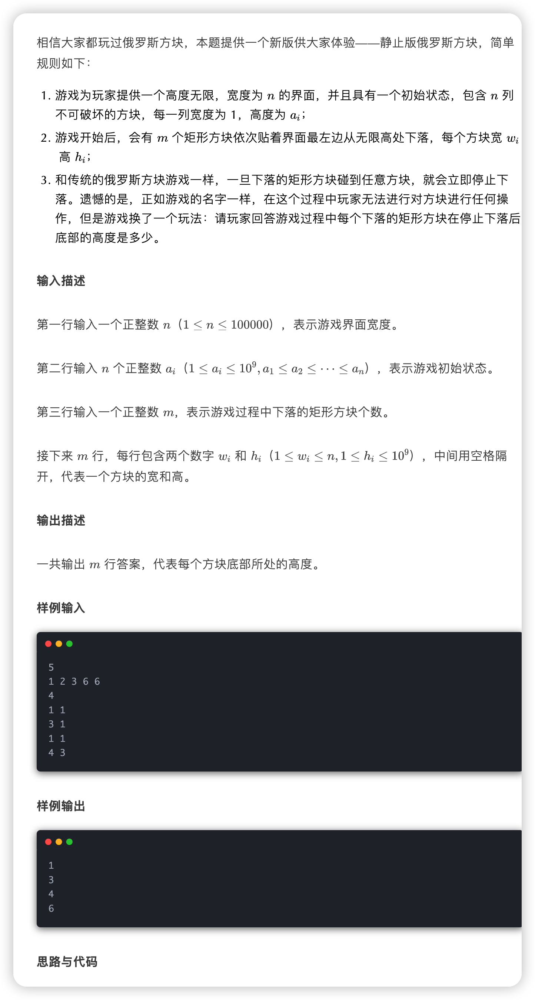

# 小米

### 8月23日 周六
#### 题型
+ 单选题
+ 多选题
+ 三道算法题

#### 难点
+ 分支限界法
+ 后缀表达式
    - 实际上就是逆波兰表达式，使用栈
+ 算术表达式
    - 根节点为算术符，可以通过二叉树的前、中、后遍历，得到前缀表达式(波兰表达式）、后缀表达式(逆波兰表达式)
+ 图论
+ 一个类实现不同的接口，方法名相同，但是参数和返回值不同，会冲突吗
    - 只要是参数不同，就可以
+ 算法：
    - 线段树
    - 动态规划

#### 算法

#### 总结
+ 如果没有思路，就先用暴力去做，如果没做出来，说明应该是思路有问题
+ 知道了读题的重要性

---

> 更新: 2024-09-08 02:18:54  
> 来源: 语雀导出
