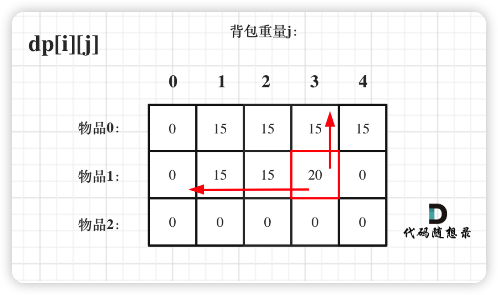

# 背包问题

## 01背包
> 做01背包的题，可以默念从内容容量为多少的，从什么物品中取，获得的最大价值是多少
>

### 含义
+ dp定义。dp[i][j]的含义为：dp【i】【j】 表示背包容量为 j 时，从 0..i 类物品种选取，可以获得的最大价值。背包容量要+1，因为有一个0背包的情况
+ 递推公式为：

```java
dp[i][j] = Math.max(dp[i - 1][j], dp[i - 1][j - weight[i]] + value[i]);
```

+ 初始化。初始化也是需要看递推公式 01背包是左上方，一般只需要更新第一行即可
+ 顺序。顺序主要是根据递推公式而来，递推公式



### 转态压缩
就是把二维dp变成一维dp，就是把物品转态给消除了也能实现。

+ 含义。dp[j]的含义：在容量为j的背包中，最大的价值为dp[j]  j还是target+1，注意物品是数字的不是索引的
+ 递推公式。实际上就是消除了i

```java
dp[j] = Math.max(dp[j], dp[j - costs[i]] + values[i]);
```

+ 初始化。dp[0]为0  
+ 遍历顺序 。 i是从0开始，j要大于物品的重量

```plain
for(int i = 0; i < weight.size(); i++) { // 遍历物品
    for(int j = bagWeight; j >= weight[i]; j--) { // 遍历背包容量
        dp[j] = max(dp[j], dp[j - weight[i]] + value[i]);

    }
}
```

### 方法
1. 如何判断是不是属于01背包问题？

最好是能记住常见的题型，能够立马反应过来，这是最好的。一般来说，先根据题意和例子，结合数据结构或者算法，画图演示一下大概过程。如果判断符合01背包的情况，如：能当做总价值（dp[j]）和重量的（j）。一般01背包主要有几部分，物品的重量（i）和价值（value[i]），背包的中容量（j）和总价值（dp[j])。

关键是能不能把问题装换为：在物品0-i中挑选，使得容量为j的背包的最大价值(重量)为dp[j]。

2. 01背包中二维和一维的转化问题？

二维比较好理解，递推公式：dp[i][j] = max(dp[i-1][j],dp[j-weight[i])+value[i])，从左往右遍历，先遍历背包或者遍历物品都可以。图像上来理解就是，下一层的数组的值由左上方来决定，每一层是互不影响的。

一维的话，dp[j] = max(dp[j],dp[j-weight[i]+value[i])，因为是在一层上的，直接操作肯定会受影响的，前面的值一直会反复的利用，因此它需要从后往前遍历

## 背包总结
### 背包问题分类：
常见的背包类型主要有以下几种：

1、0/1背包问题：每个元素最多选取一次

2、完全背包问题：每个元素可以重复选择

3、组合背包问题：背包中的物品要考虑顺序

4、分组背包问题：不止一个背包，需要遍历每个背包

而每个背包问题要求的也是不同的，按照所求问题分类，又可以分为以下几种：

1、最值问题：要求最大值/最小值

2、存在问题：是否存在…………，满足…………

3、组合问题：求所有满足……的排列组合

因此把背包类型和问题类型结合起来就会出现以下细分的题目类型：

1、0/1背包最值问题

2、0/1背包存在问题

3、0/1背包组合问题

4、完全背包最值问题

5、完全背包存在问题

6、完全背包组合问题

7、分组背包最值问题

8、分组背包存在问题

9、分组背包组合问题

这九类问题我认为几乎可以涵盖力扣上所有的背包问题

### 分类解题模板
背包问题大体的解题模板是两层循环，分别遍历物品nums和背包容量target，然后写转移方程，根据背包的分类我们确定物品和容量遍历的先后顺序，根据问题的分类我们确定状态转移方程的写法

首先是背包分类的模板：

1、0/1背包：外循环nums,内循环target,target倒序且target>=nums[i];

2、完全背包：外循环nums,内循环target,target正序且target>=nums[i];  完全背包单dp不需要倒叙

3、组合背包：外循环target,内循环nums,target正序且target>=nums[i]; 排列的话倒叙

4、分组背包：这个比较特殊，需要三重循环：外循环背包bags,内部两层循环根据题目的要求转化为1,2,3三种背包类型的模板

然后是问题分类的模板：

1、最值问题: dp[i] = max/min(dp[i], dp[i-nums]+1)或dp[i] = max/min(dp[i], dp[i-num]+nums[i]);

2、存在问题(bool)：dp[i]=dp[i] | | dp[i-num];

3、组合问题：dp[i] +=dp[i-num];

---

> 更新: 2025-04-27 01:27:28  
> 来源: 语雀导出
