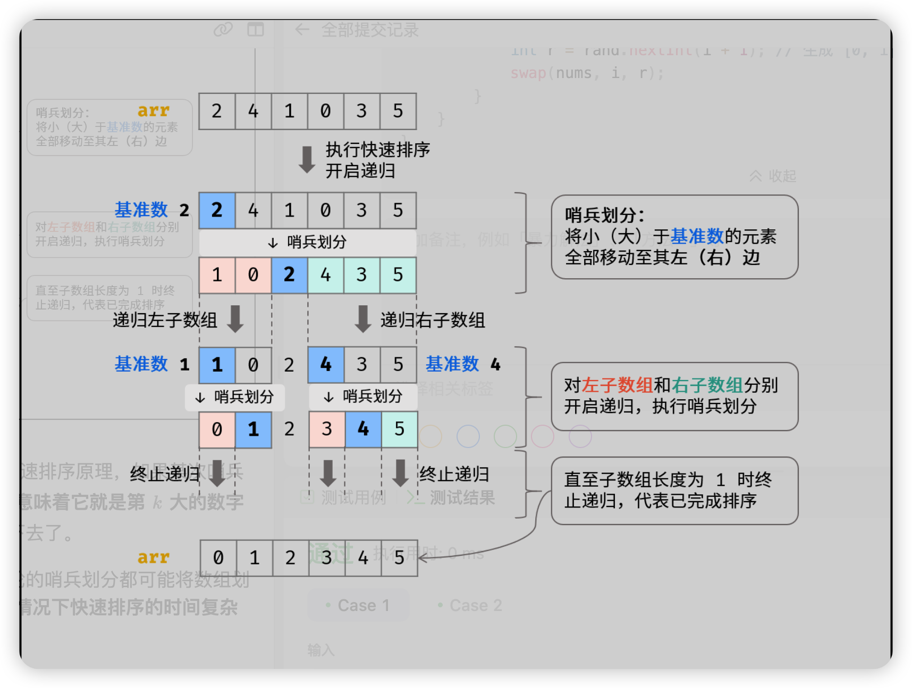

# 快速排序

快速排序像是前序遍历：分区、左边递归、右边递归。nlog(n)不稳定

比较重要的就是如何分区，分区就是把基地分成两部分，左边是小于基地，右边是大于基点。基点的选择可以有随机性行·



#### 代码块
```java
public class QuickSort {
    public static void quickSort(int[] arr, int left, int right) {
        if (left >= right) return; // 递归出口

        int i = left, j = right;
        int pivot = arr[left]; // 1. 选基准（挖出第一个坑）

        while (i < j) {
            // 2. 右边先走，找小于基准的数填到左边的坑
            while (i < j && arr[j] >= pivot) j--; 
            if (i < j) arr[i] = arr[j]; 

            // 3. 左边走，找大于基准的数填到右边的坑
            while (i < j && arr[i] <= pivot) i++; 
            if (i < j) arr[j] = arr[i]; 
        }

        arr[i] = pivot; // 4. 基准归位（最后的坑填上基准）

        // 5. 递归处理左右两边
        quickSort(arr, left, i - 1);
        quickSort(arr, i + 1, right);
    }
}
```

#### 优化-三路快排
避免重复的值分区

```java
public class QuickSort3Way {

    public static void sort(int[] arr, int left, int right) {
        if (left >= right) return;

        // 1. 选基准（这里简单选第一个，也可以随机选）
        int pivot = arr[left];
        
        // 2. 定义三个指针
        int lt = left;       // [left+1...lt] 是小于区
        int gt = right;      // [gt...right] 是大于区
        int i = left + 1;    // 从第二个元素开始遍历

        // 3. 核心分区逻辑 (i 撞上 gt 时结束)
        while (i <= gt) {
            if (arr[i] < pivot) {
                swap(arr, i, lt);
                lt++;
                i++;
            } else if (arr[i] > pivot) {
                swap(arr, i, gt);
                gt--; 
                // 注意：这里 i 不移动，因为换回来的 arr[gt] 还没检查过
            } else {
                i++; // 相等时，直接跳过，扩充等于区
            }
        }

        // 4. 递归（注意：中间的 [lt...gt] 是等于区，已经排好了，不用管！）
        sort(arr, left, lt - 1);
        sort(arr, gt + 1, right);
    }

    private static void swap(int[] arr, int i, int j) {
        int temp = arr[i];
        arr[i] = arr[j];
        arr[j] = temp;
    }
}
```

---

> 更新: 2025-05-16 22:42:54  
> 来源: 语雀导出
