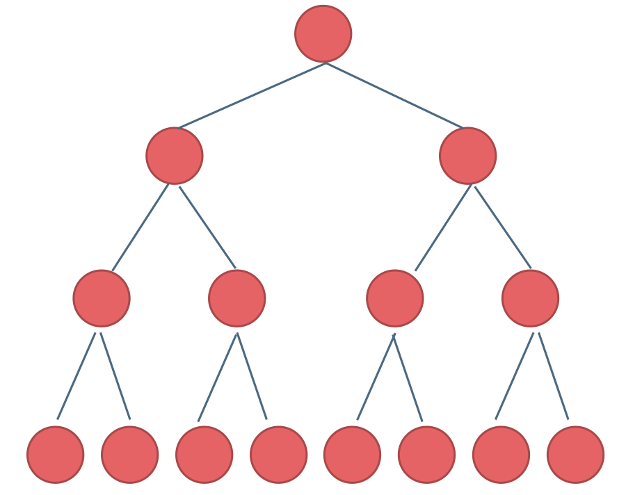
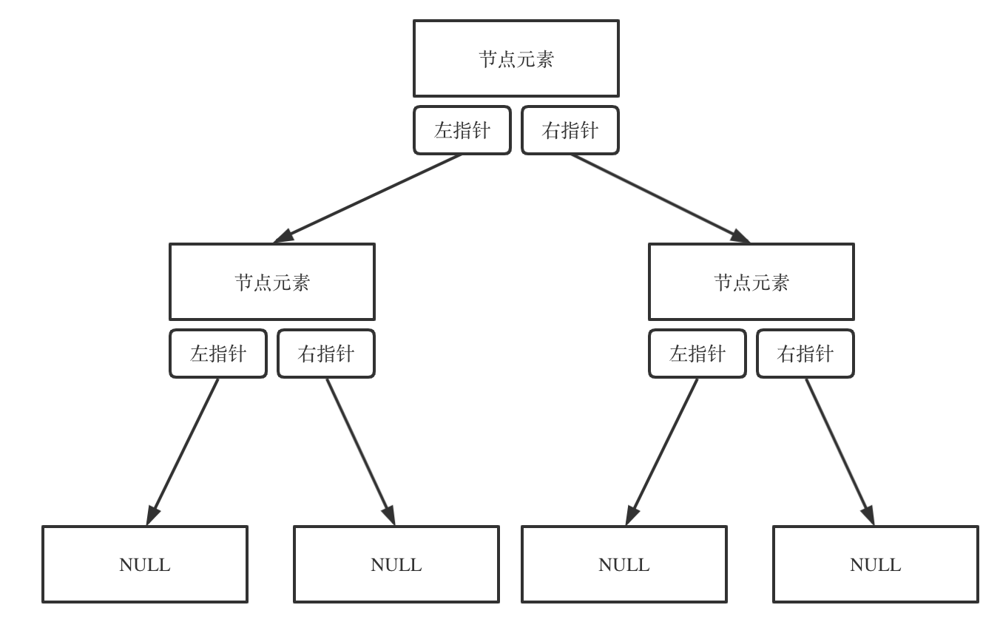
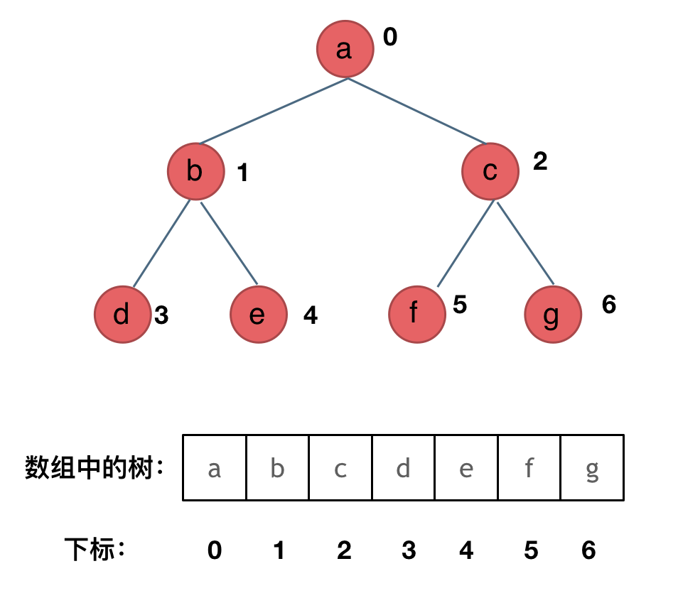

# 基础

## 二叉树种类
满二叉树

完全二叉树

### 满二叉树：
如果一棵二叉树只有度为0的结点和度为2的结点，并且度为0的结点在同一层上，则这棵二叉树为满二叉树。也可以说深度为k，有2^k-1个节点的二叉树。

## 完全二叉树：
完全二叉树的定义如下：在完全二叉树中，除了最底层节点可能没填满外，其余每层节点数都达到最大值，并且最下面一层的节点都集中在该层最左边的若干位置。若最底层为第 h 层（h从1开始），则该层包含 1~ 2^(h-1) 个节点。

## 二叉搜索树
### 平衡二叉搜索树（AVL）
且具有以下性质：它是一棵空树或它的左右两个子树的高度差的绝对值不超过1，并且左右两个子树都是一棵平衡二叉树。

二、二叉树存储方式

链式存储

顺式存储

三、遍历方式

+ 深度优先
    - 前序。
    - 中序
    - 后序
+ 广度优先

---

> 更新: 2025-08-23 05:58:54  
> 来源: 语雀导出
