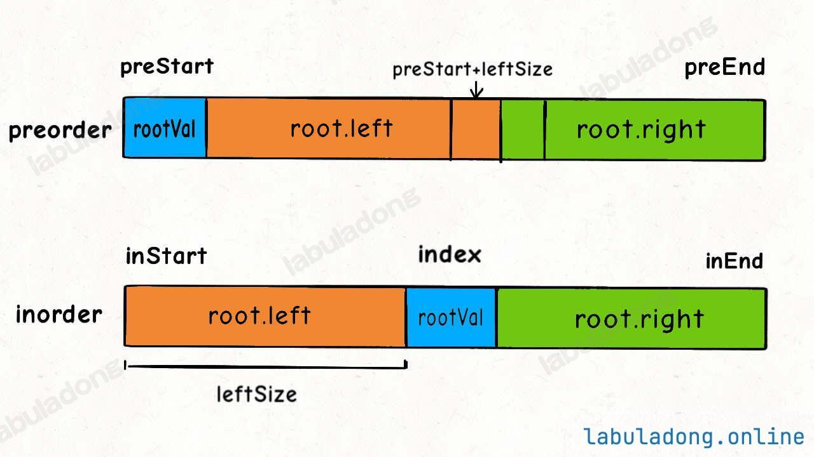
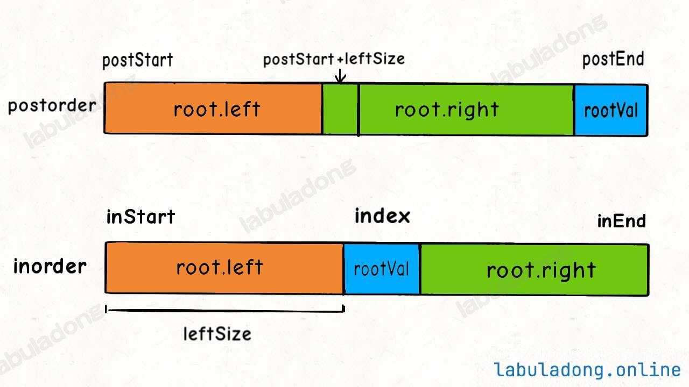

# 构造二叉树

通过分解的想法，先找root，然后连接left和right。

实际上，前序是找root的方式，然后中序是确立区间(leftSize长度)，除此之外，还需要一个map映射

移动方向，根据前、中原本的方向而定

前后序的构造。基本上和前序一样

```java
if(preStart == preEnd){
    return new TreeNode(nums[preStart])
}

int rootVal = preorder[preStart];
        // root.left 的值是前序遍历第二个元素
        // 通过前序和后序遍历构造二叉树的关键在于通过左子树的根节点
        // 确定 preorder 和 postorder 中左右子树的元素区间
        int leftRootVal = preorder[preStart + 1];
        // leftRootVal 在后序遍历数组中的索引
        int index = valToIndex.get(leftRootVal);
        // 左子树的元素个数
        int leftSize = index - postStart + 1;
```

#### 前中


#### 后中


#### 前后

#### 

---

> 更新: 2025-09-11 22:09:00  
> 来源: 语雀导出
