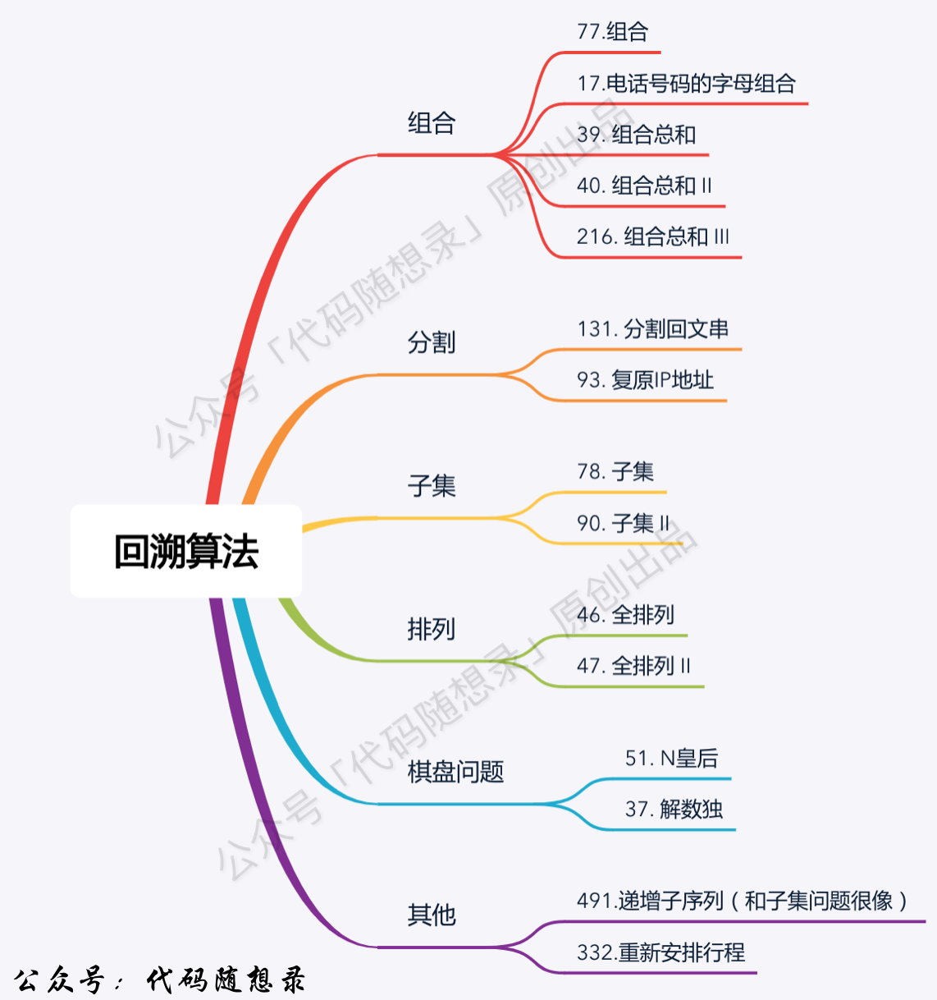

# 回溯总结

### 一、题型：
1. 组合
2. 分割
3. 排列



### 二、解题思路：
1. 画图。根据题目的意思去画图，模拟过程
2. 确立三步。回溯的三步很好搞，不像二叉树，不仅前中后序都要确立，基本上没有固定的模版，而这个模版都是固定的，基本上上手就能写，主要是条件的筛选很重要。
3. 剪枝。代码完成以后，看一下有没有要优化的了，因为回溯效率比较慢，要记得剪枝。

### 三、题目分析
#### 组合：
组合问题是回溯最经典的问题，注意的点有startIndex的使用，组合数组是否可重复的问题。

注意的点：

1. startIndex 使用的话，是为了防止出现重复的组合。一个集合求求组合就需要startIndex，如果是多个集合取组合，各个集合之间相互不影响，那么就不用startIndex，因为不用担心重复的问题，就是需要把数组每一层都要记得给传入进来。给下一层的startIndex是i+1,而不是startIndex，因为当层的startIndex，并不一定等于i。startIndex可以作为数字可以重复使用的时候，startIndex= i;

1. 数组含有可重复元素。要进行树层去重，而不是树枝去重。如果有数据可以排序的话，一般利用数组就好了，如果不能排序的话，只能乖乖用hashset去重了。
2. 细节。字符串的增加减，可以使用StringBuilder，替换掉path了

##### 特列：不同的集合
```java
class Solution {
    // 跳过0,1
    private static final String[] MAPPING = new String[] { "", "", "abc", "def", "ghi", "jkl", "mno", "pqrs", "tuv",
            "wxyz" };
    StringBuilder path = new StringBuilder(); // 路径
    List<String> res = new ArrayList<>();

    public List<String> letterCombinations(String digits) {
        backtracking(digits,0);
        return res;
      
    }
    // 不用担心重复问题，因为不是同一组的数，通过digits和startIndex获取集合
    public void backtracking(String digits,int startIndex){

        if(path.length() == digits.length()){
            res.add(path.toString());
            return;
        }

        int num = digits.charAt(startIndex) - '0';
        for(char c : MAPPING[num].toCharArray()){
            path.append(c);
            backtracking(digits,startIndex+1);
            path.deleteCharAt(path.length()-1);
        }
    }
}
```

#### 分割
分割问题其实就是组合问题，相邻的数组合，而不是随意的。切割的过程也值得考究，切割过的地方不能继续切割了，startIndex = i+1，

#### 子集
组合问题和分割问题都是收集树的叶子节点，而子集问题是找树的所有节点！子集和组合都是不讲顺序的，所以startIndex 都要从i+1开始取。

#### 排列
全排列和子集不同，是有限制的，个数不是所有的，就是取原数组的长度，只取没有用到的，所以用used数组记录。

---

> 更新: 2025-09-26 16:22:48  
> 来源: 语雀导出
