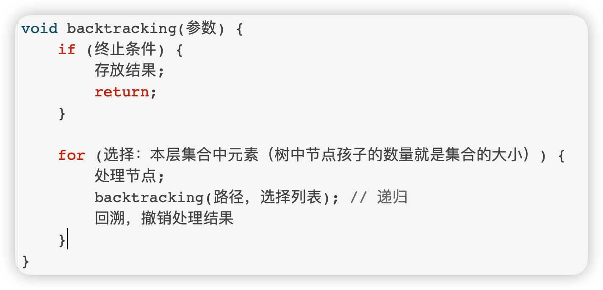
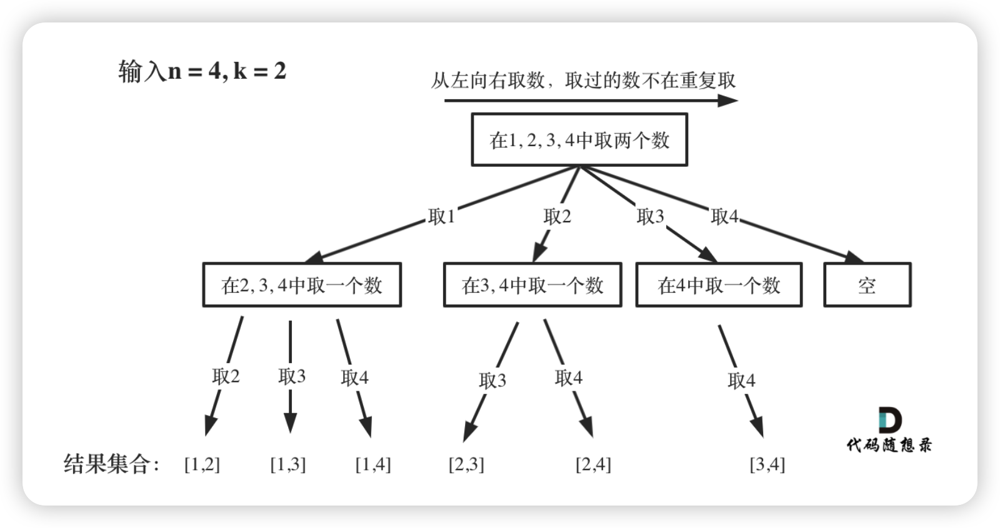
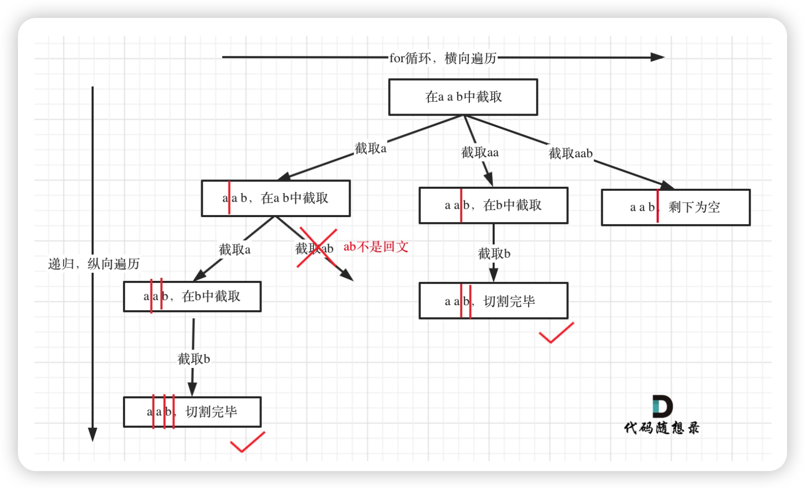
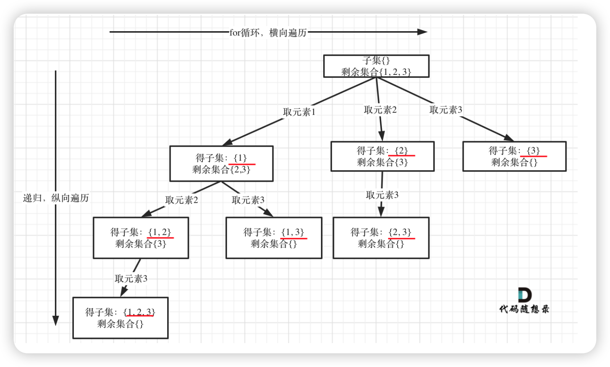
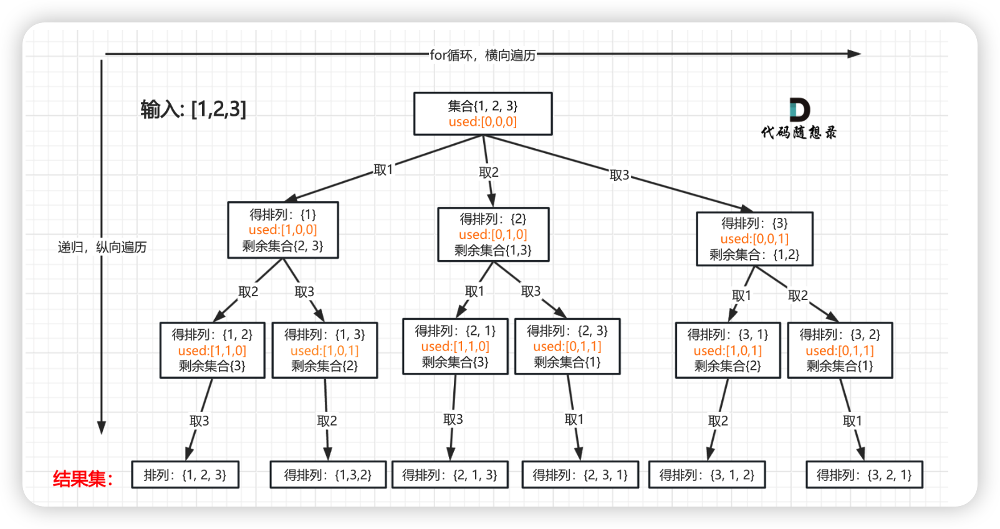

# 理论基础

### 一、什么是回溯算法？
说一下我的理解，回溯法可以看做成一种搜索方式。回溯是递归的副产品，只要有递归就会有回溯。

回溯的本质是穷举，实际上效率也一般，那为什么还要用回溯呢，因为有的时候没得选呀，以下一些场景必须要用回溯:  
• 组合问题：N个数里面按一定规则找出k个数的集合  
• 切割问题：一个字符串按一定规则有几种切割方式  
• 子集问题：一个N个数的集合里有多少符合条件的子集  
• 排列问题：N个数按一定规则全排列，有几种排列方式  
• 棋盘问题：N皇后，解数独等等

### 二、如何理解回溯算法？
  
记住! 所有的回溯算法都可以抽象成树形结构，<u>集合的长度就是树的宽度，递归的深度就是树的深度</u>，递归必然都会有条件，所以是一个高度有限的N叉树。

### 三、模版
  
还是三步走：  
    1. 确定返回值和参数。回溯算法中返回值一般都是void，因为一般都会定义成员变量去存储。  
    2. 终止条件。就是树的高度，有些有明显的提示，有一些没有  
    3. 递归逻辑。一个for循环遍历数据的宽度，加一个递归，要注释startIndex的使用

四、如何画图

**组合：**

**分割：**

**子集：**

**全排列**

---

> 更新: 2025-10-02 22:35:43  
> 来源: 语雀导出
