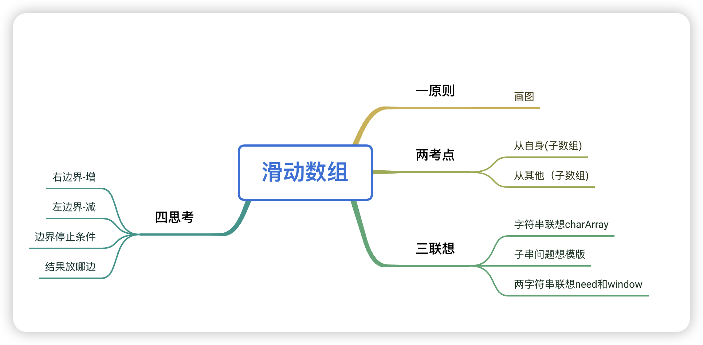

# 滑动窗口

> **看需要的数据是什么，最长一般是末尾，最少一般是在left区间中，有一些是right++就需要判断的(比如存在重复元素)**
>

### 一、模版
现在开始套模板，只需要思考以下四个问题：

1、当移动 right 扩大窗口，即加入字符时，应该更新哪些数据？

2、什么条件下，窗口应该**暂停扩大**，开始移动 left 缩小窗口？

3、当移动 left 缩小窗口，即移出字符时，应该更新哪些数据？

4、我们要的结果应该在扩大窗口时还是缩小窗口时进行更新？

### 二、思维导图


### 三、延伸：字符匹配算法
位运算操作

```java
// ****** 在最低位添加一个数字 ******
// number 的进制
int R = 4;
// 想在 number 的最低位添加的数字
int appendVal = 0~3 中的任意数字;
// 运算，在最低位添加一位
number = R * number + appendVal;

// ****** 在最高位删除一个数字 ******
// number 的进制
int R = 4;
// number 最高位的数字
int removeVal = 0~3 中的任意数字;
// 此时 number 的位数
int L = ?;
// 运算，删除最高位数字
number = number - removeVal * R^(L-1);
```

---

> 更新: 2026-01-29 16:44:55  
> 来源: 语雀导出
