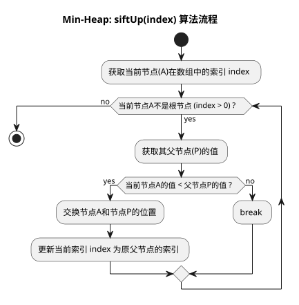
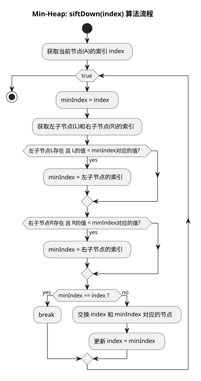

# 最小堆

最小堆是特殊的完全二叉树(左倾性），他的根节点永远比两个子节点都要小。和最小栈有点像（但是是最近压入的)

### 实现代码
```java
class MinHeap {
    private List<Integer> heap; // 使用动态数组存储堆

    // 构造函数
    public MinHeap() {
        heap = new ArrayList<>();
    }

    // ========== 核心公开方法 ==========

    /**
     * 插入一个新元素
     */
    public void insert(int value) {
        // 1. 将元素添加到数组末尾
        heap.add(value);
        
        // 2. 获取新元素的索引
        int currentIndex = heap.size() - 1;
        
        // 3. 执行上浮操作，维护堆的性质
        siftUp(currentIndex);
    }

    /**
     * 删除并返回堆顶的最小值
     */
    public int extractMin() {
        if (heap.isEmpty()) {
            throw new NoSuchElementException("Heap is empty.");
        }

        // 1. 获取堆顶的最小值
        int minValue = heap.get(0);
        
        // 2. 获取最后一个元素
        int lastValue = heap.get(heap.size() - 1);
        
        // 3. 将最后一个元素移动到堆顶
        heap.set(0, lastValue);
        
        // 4. 移除数组末尾的元素
        heap.remove(heap.size() - 1);

        // 5. 如果堆不为空，执行下沉操作，重新维护堆的性质
        if (!heap.isEmpty()) {
            siftDown(0);
        }
        
        // 6. 返回最小值
        return minValue;
    }

    // ========== 核心辅助方法 (私有) ==========

    /**
     * 上浮操作：将指定索引的节点向上调整，直到满足堆性质
     */
    private void siftUp(int index) {
        // 只要当前节点不是根节点，并且比其父节点小，就继续上浮
        while (index > 0 && heap.get(index) < heap.get(parentIndex(index))) {
            swap(index, parentIndex(index));
            index = parentIndex(index); // 更新当前节点的索引为其父节点的索引
        }
    }

    /**
     * 下沉操作：将指定索引的节点向下调整，直到满足堆性质
     */
    private void siftDown(int index) {
        int minIndex = index; // 假设当前节点是最小的

        while (true) {
            int left = leftChildIndex(index);
            int right = rightChildIndex(index);
            int heapSize = heap.size();

            // 检查左子节点是否存在且比当前最小节点更小
            if (left < heapSize && heap.get(left) < heap.get(minIndex)) {
                minIndex = left;
            }

            // 检查右子节点是否存在且比当前最小节点更小
            if (right < heapSize && heap.get(right) < heap.get(minIndex)) {
                minIndex = right;
            }

            // 如果最小节点就是当前节点自己，说明下沉结束
            if (minIndex == index) {
                break; 
            }

            // 否则，与更小的子节点交换，并继续从新位置下沉
            swap(index, minIndex);
            index = minIndex;
        }
    }

    // ========== 工具方法 ==========
    private int parentIndex(int i) { return (i - 1) / 2; }
    private int leftChildIndex(int i) { return 2 * i + 1; }
    private int rightChildIndex(int i) { return 2 * i + 2; }
    private void swap(int i, int j) {
        int temp = heap.get(i);
        heap.set(i, heap.get(j));
        heap.set(j, temp);
    }
}
```

### 图解




---

> 更新: 2026-02-24 14:17:36  
> 来源: 语雀导出
