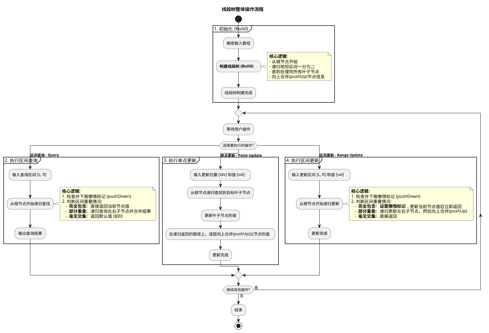

# 线段树

线段树（Segment Tree）是一种高级数据结构，它本质上是一棵**二叉树**，专门用于高效处理数组或线段上的**区间（或范围）查询**和**区间更新**问题。

想象一下你有一个数组，现在需要反复询问“第 i 个位置到第 j 个位置所有数字的总和是多少？”或者“这个区间的最大值是多少？”。如果数组很大，或者查询次数非常多，每次都用循环去遍历这个区间会非常慢（时间复杂度为 O(n)）。而线段树，正是为了解决这类问题而生的，它可以将这些操作的时间复杂度优化到 **O(log n)**。

### 伪代码
```java
/**
 * 线段树的整体伪代码实现
 * (以区间求和为例)
 */
class SegmentTree {
    private int[] tree; // 用于存储树节点的数组
    private int[] lazy; // 懒惰标记数组
    private int[] originalData; // 原始数组的引用
    private int dataSize; // 原始数组的大小

    // 构造函数：初始化并建树
    public SegmentTree(int[] inputArray) {
        dataSize = inputArray.length;
        if (dataSize == 0) return;

        originalData = inputArray;
        tree = new int[4 * dataSize];
        lazy = new int[4 * dataSize];
        
        build(0, 0, dataSize - 1);
    }

    // --- 公共接口 ---

    /**
     * 对外提供的区间查询接口
     * @param left  查询区间的左边界
     * @param right 查询区间的右边界
     */
    public int query(int left, int right) {
        return queryRecursive(0, 0, dataSize - 1, left, right);
    }

    /**
     * 对外提供的单点更新接口
     * @param index 要更新的元素索引
     * @param value 要增加的值
     */
    public void pointUpdate(int index, int value) {
        pointUpdateRecursive(0, 0, dataSize - 1, index, value);
    }
    
    /**
     * 对外提供的区间更新接口
     * @param left  更新区间的左边界
     * @param right 更新区间的右边界
     * @param value 区间内每个元素要增加的值
     */
    public void rangeUpdate(int left, int right, int value) {
        rangeUpdateRecursive(0, 0, dataSize - 1, left, right, value);
    }

    // --- 内部递归实现 ---

    /**
     * 1. 建树的递归实现
     */
    private void build(int node, int start, int end) {
        if (start == end) {
            tree[node] = originalData[start];
            return;
        }
        int mid = (start + end) / 2;
        build(2 * node + 1, start, mid);
        build(2 * node + 2, mid + 1, end);
        tree[node] = tree[2 * node + 1] + tree[2 * node + 2];
    }

    /**
     * 2. 查询的递归实现
     */
    private int queryRecursive(int node, int start, int end, int L, int R) {
        // 先下推懒惰标记
        pushDown(node, start, end);

        // 如果当前区间与查询区间无交集，返回0
        if (start > R || end < L) return 0;
        
        // 如果当前区间被完全包含，直接返回值
        if (L <= start && end <= R) return tree[node];

        // 否则，递归查询左右子节点并合并结果
        int mid = (start + end) / 2;
        int leftResult = queryRecursive(2 * node + 1, start, mid, L, R);
        int rightResult = queryRecursive(2 * node + 2, mid + 1, end, L, R);
        return leftResult + rightResult;
    }

    /**
     * 3. 单点更新的递归实现
     */
    private void pointUpdateRecursive(int node, int start, int end, int idx, int val) {
        if (start == end) {
            tree[node] += val;
            return;
        }
        int mid = (start + end) / 2;
        if (idx <= mid) {
            pointUpdateRecursive(2 * node + 1, start, mid, idx, val);
        } else {
            pointUpdateRecursive(2 * node + 2, mid + 1, end, idx, val);
        }
        tree[node] = tree[2 * node + 1] + tree[2 * node + 2];
    }
    
    /**
     * 4. 区间更新的递归实现
     */
    private void rangeUpdateRecursive(int node, int start, int end, int L, int R, int val) {
        // 先下推懒惰标记
        pushDown(node, start, end);
        
        // 如果当前区间与更新区间无交集，直接返回
        if (start > R || end < L) return;
        
        // 如果当前区间被完全包含，更新当前节点并打上懒惰标记
        if (L <= start && end <= R) {
            lazy[node] += val;
            pushDown(node, start, end); // 立即处理当前节点，以便父节点能正确合并
            return;
        }
        
        // 否则，递归更新左右子节点
        int mid = (start + end) / 2;
        rangeUpdateRecursive(2 * node + 1, start, mid, L, R, val);
        rangeUpdateRecursive(2 * node + 2, mid + 1, end, L, R, val);
        
        // 回溯时，用已更新的子节点合并结果
        tree[node] = tree[2 * node + 1] + tree[2 * node + 2];
    }
    
    /**
     * 5. 下推懒惰标记的核心辅助函数
     */
    private void pushDown(int node, int start, int end) {
        if (lazy[node] == 0) return; // 没有标记，无需下推

        // 更新当前节点的值
        tree[node] += lazy[node] * (end - start + 1);

        // 如果不是叶子节点，将标记传递给子节点
        if (start != end) {
            lazy[2 * node + 1] += lazy[node];
            lazy[2 * node + 2] += lazy[node];
        }

        // 清除当前节点的标记
        lazy[node] = 0;
    }
}
```

### 图解


---

> 更新: 2026-04-07 01:02:27  
> 来源: 语雀导出
