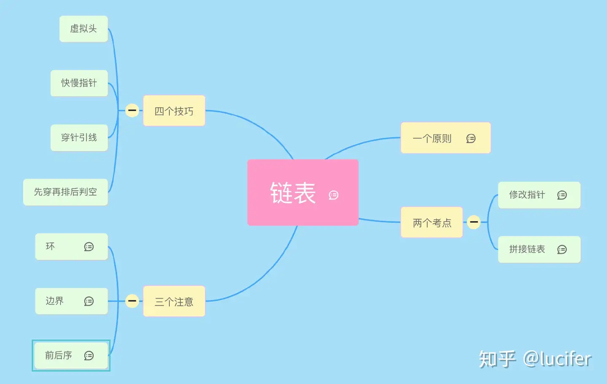
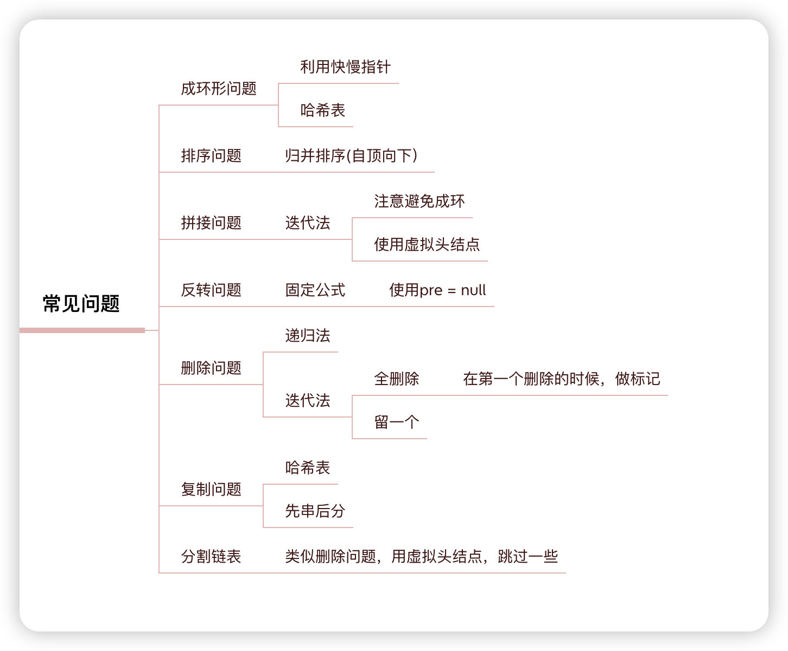

# 宝典

### 导图

### 删除链表
删除链表通常需要借助虚拟头节点，因为不排除需要删除头节点的情况，除非自己做个头节点的情况。 

删除链表一般都需要找到cur.next,也就是被删的前一个节点，但是如果知道了位置（比如索引），那直接遍历到这个位置即可。删除链表还有种办法，把这个节点的状态(next、val)都改了，好像相当于这个节点没存在过一样。 

删除所有的重复元素，要记录一下要删的元素的后面两个元素，删除不包含自己的呢，需要比较它和下一个即可 

### 插入链表
插入链表，一般是插入到有序的，比删除简单，直接找到cur就行了。 

### 反转链表
反转链表一般是两个之间进行交换，或者两两交换 

两两交换需要三个节点 

### 前后指针
前后指针一般用于倒数的第N个节点的处理上，因为链表是单向的，我们可以利用前后指针，来找到倒数的位置。 

注意一般说的倒数第几个节点，不包括索引，所以计算要从i=1开始。 

计算链表长度，如果用的cur！=null，length从0开始，如果是cur.next!=null,length要从1开始 

### 快慢指针
通常用来找链表的中间节点，偶数的是正中间的右边，奇数则刚刚好。 

还有用来判断或者查找链表中有没有环 

### 合并链表
这个很好分辨，常见的题型链表相加、有序链表合并 

链表相加的进位有点东西，一般从前往后进位，sum每次加完之后，也要计算下一次的进位。结束后的进位，需要额外添加一次

---

> 更新: 2026-05-05 05:25:47  
> 来源: 语雀导出
